# 01. 业务全景：Craft Agents 到底在解决什么问题

## 给产品经理的一句话

Craft Agents 是一个“让用户以会话为中心，调度多个 AI Agent、外部数据源和工具来完成真实工作的系统”。它的业务重点不是模型本身，而是把“意图 -> 工具执行 -> 权限确认 -> 结果沉淀 -> 自动化复用”做成一个完整工作流。

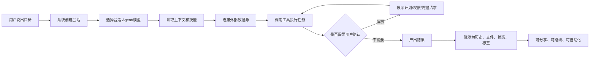

## 这不是普通聊天产品

普通聊天产品的业务闭环通常是：

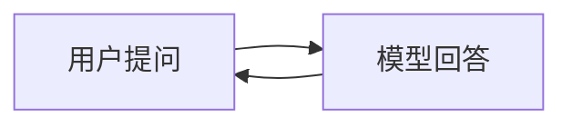

Craft Agents 的业务闭环更长：

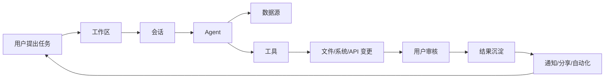

这意味着产品设计重点不只是“回答好不好”，还包括：

- 用户如何组织任务。
- Agent 如何知道哪些外部系统可用。
- 什么时候必须让用户确认。
- 执行过程如何透明。
- 结果如何沉淀为可追踪的工作记录。
- 是否能从一次性聊天升级为可复用流程。

## 关键角色

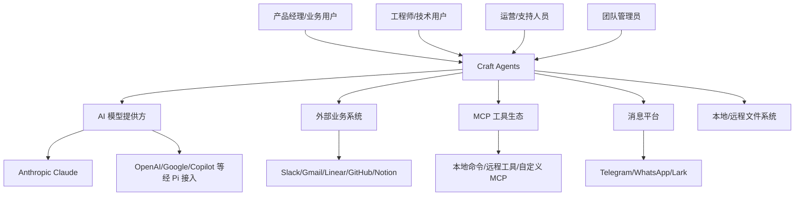

## 产品能力地图

```mermaid
flowchart TB
  ROOT["Craft Agents 产品能力"] --> C1["任务组织"]
  ROOT --> C2["Agent 执行"]
  ROOT --> C3["外部能力接入"]
  ROOT --> C4["信任与控制"]
  ROOT --> C5["协作与分发"]
  ROOT --> C6["自动化"]

  C1 --> C11["Workspace 工作区"]
  C1 --> C12["Session 会话"]
  C1 --> C13["标签和状态"]
  C1 --> C14["归档/置顶/未读"]

  C2 --> C21["Claude 后端"]
  C2 --> C22["Pi 后端"]
  C2 --> C23["模型/Thinking Level"]
  C2 --> C24["流式执行过程"]

  C3 --> C31["Sources 数据源"]
  C3 --> C32["Skills 技能"]
  C3 --> C33["MCP 工具"]
  C3 --> C34["REST API 包装工具"]

  C4 --> C41["权限模式"]
  C4 --> C42["计划审批"]
  C4 --> C43["凭据/OAuth"]
  C4 --> C44["远程 TLS/token"]

  C5 --> C51["Electron 桌面"]
  C5 --> C52["Web UI"]
  C5 --> C53["CLI"]
  C5 --> C54["Viewer 分享"]

  C6 --> C61["事件触发"]
  C6 --> C62["定时任务"]
  C6 --> C63["Webhook"]
  C6 --> C64["消息平台审批"]
```

## 核心业务对象

| 对象 | 产品含义 | 用户能感知到什么 |
| --- | --- | --- |
| Workspace | 一组业务上下文和配置的容器 | 我的项目、团队空间、客户空间 |
| Session | 一次任务或一串连续工作 | 一个对话、一项任务、一条工作记录 |
| Agent | 执行任务的智能体后端 | 不同模型能力、不同执行方式 |
| Source | 外部系统或数据入口 | 连接 Slack、Linear、Gmail、GitHub |
| Skill | 让 Agent 学会特定做法的说明书 | 团队 SOP、领域知识、工作套路 |
| Tool | Agent 可调用的实际动作 | 读文件、改代码、调 API、发消息 |
| Permission | 执行边界 | 是否允许 Agent 改东西 |
| Plan | 执行前承诺 | Agent 先列计划，用户批准再做 |
| Automation | 可复用流程 | 状态变化后自动触发任务 |
| Messaging Binding | 外部聊天与会话绑定 | 在 Telegram/WhatsApp 里推进任务 |

## 价值链路

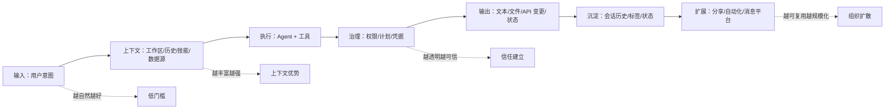

## 三个业务飞轮

### 1. 能力飞轮

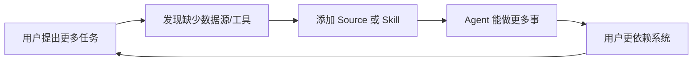

### 2. 信任飞轮

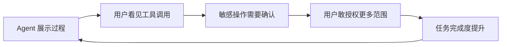

### 3. 组织飞轮

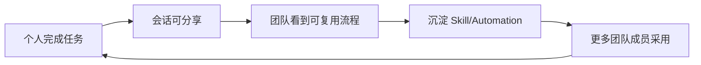

## 端到端用户旅程

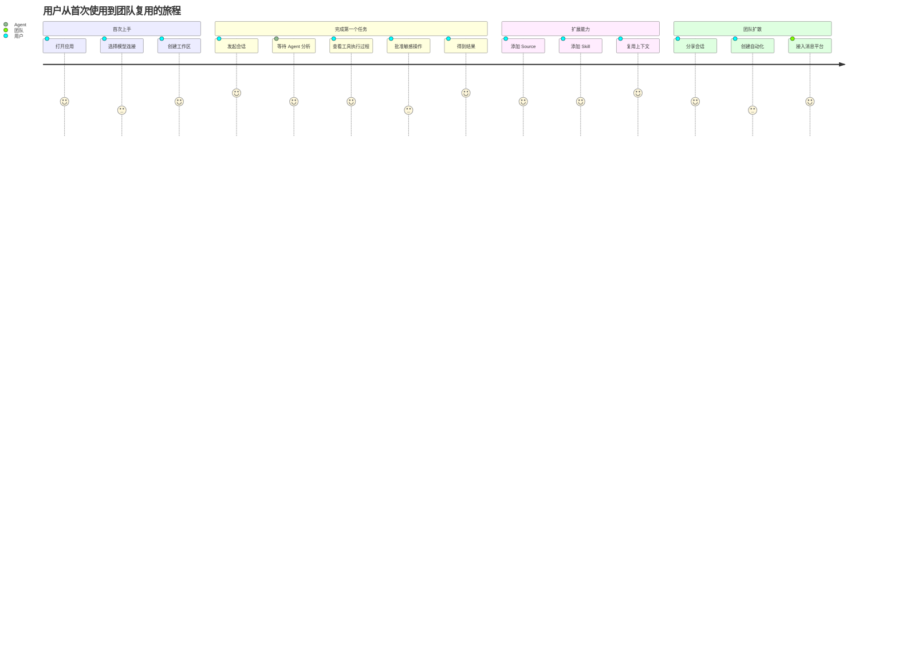

## 产品经理最该追问的问题

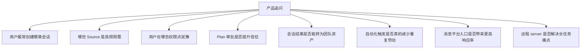

## 本文结论

Craft Agents 的业务逻辑可以概括为：

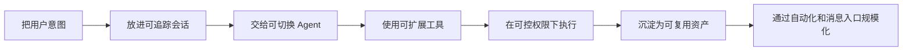

