# 02. 会话生命周期：一次任务从开始到完成怎么走

## 为什么会话是核心业务对象

在 Craft Agents 里，Session 不只是聊天记录。它更像一个“任务容器”：

- 记录用户目标。
- 记录 Agent 的思考和执行过程。
- 记录工具调用和结果。
- 管理权限、计划、凭据请求。
- 保存附件、生成文件、长响应、下载产物。
- 承载标签、状态、归档、未读等协作信息。

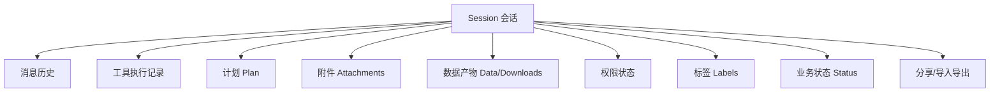

## 一次会话的总流程

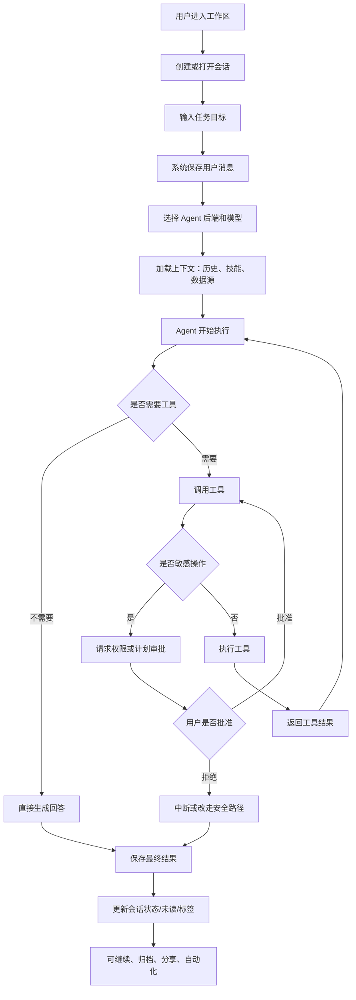

## 会话状态机

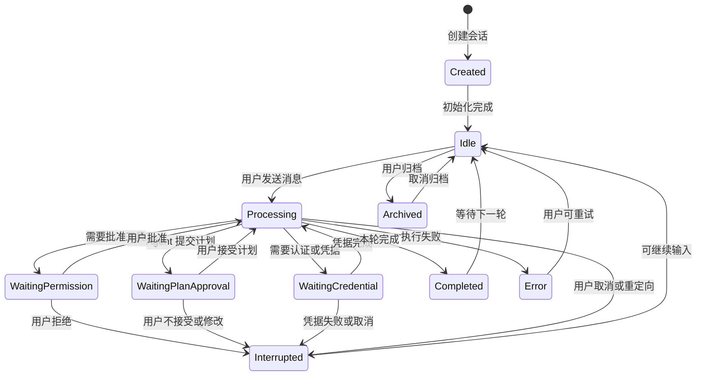

## 用户、界面、后端、Agent 的协作时序

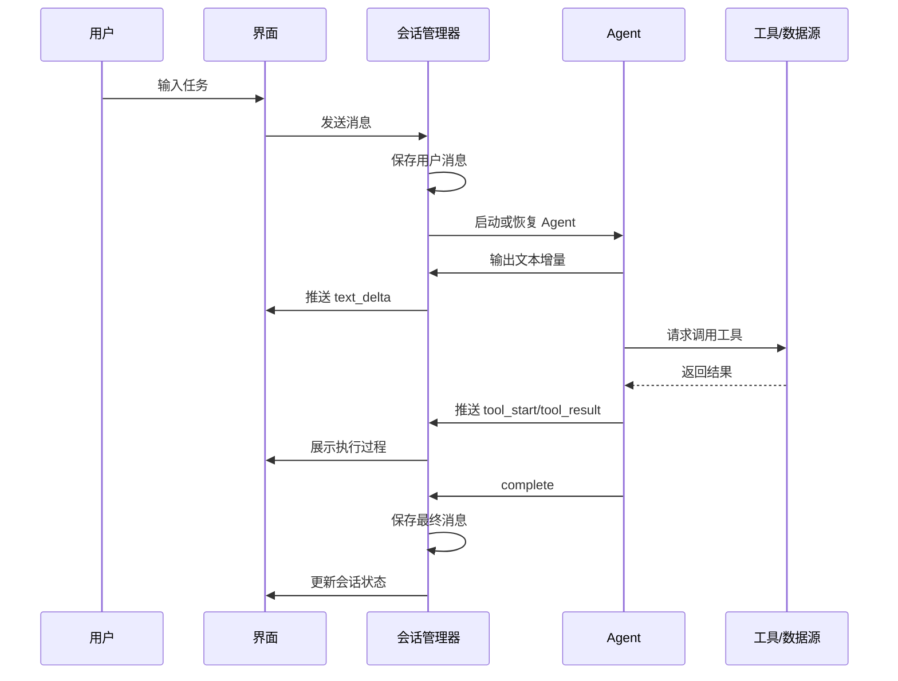

## 权限审批分支

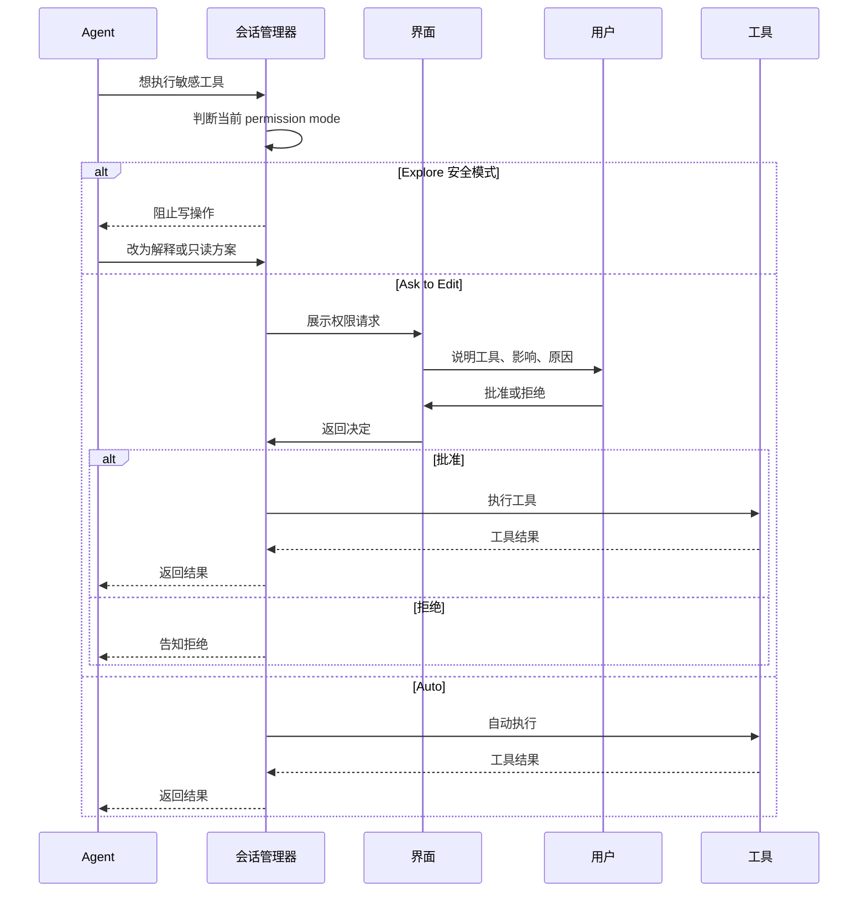

## 计划审批分支

Plan 是一个非常重要的业务机制：它把“Agent 准备怎么做”变成用户可确认的契约。

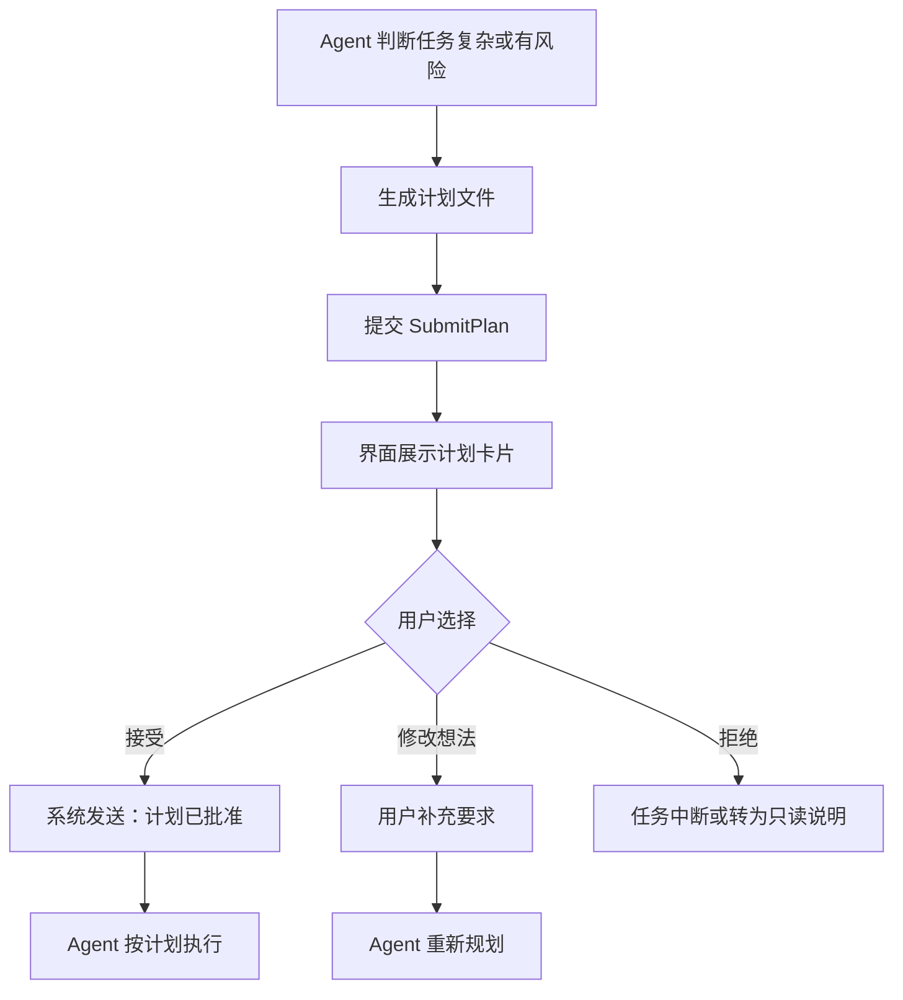

产品价值：

- 用户更容易理解 Agent 接下来要做什么。
- 风险较高任务可以先对齐。
- 计划可以沉淀为团队工作方法。
- 消息平台也可以通过按钮批准计划。

## Credential/OAuth 分支

很多业务系统需要认证，例如 Slack、Google、Microsoft、GitHub。会话里可能出现“需要重新登录或输入凭据”的中断点。

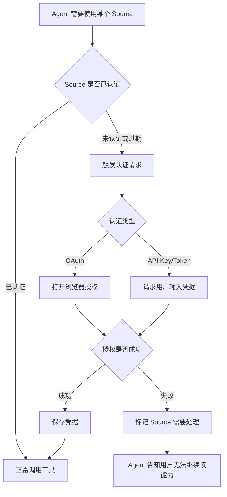

## 会话中的业务状态

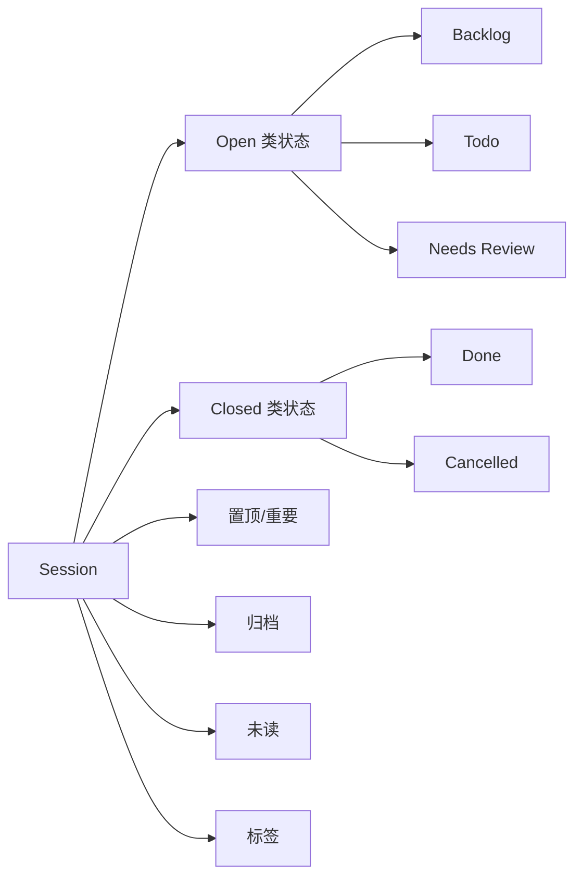

这些字段让会话从“聊天记录”变成“任务管理对象”。产品上可以继续挖：

- 状态是否适合团队真实工作流。
- 标签是否能表达项目、优先级、客户、风险。
- 未读和通知是否帮助用户跟进长任务。
- 会话列表是否可以变成轻量任务看板。

## 分支与转移

用户可能希望从某条消息开始另开一条思路，或者把 session 转移到远程工作区。

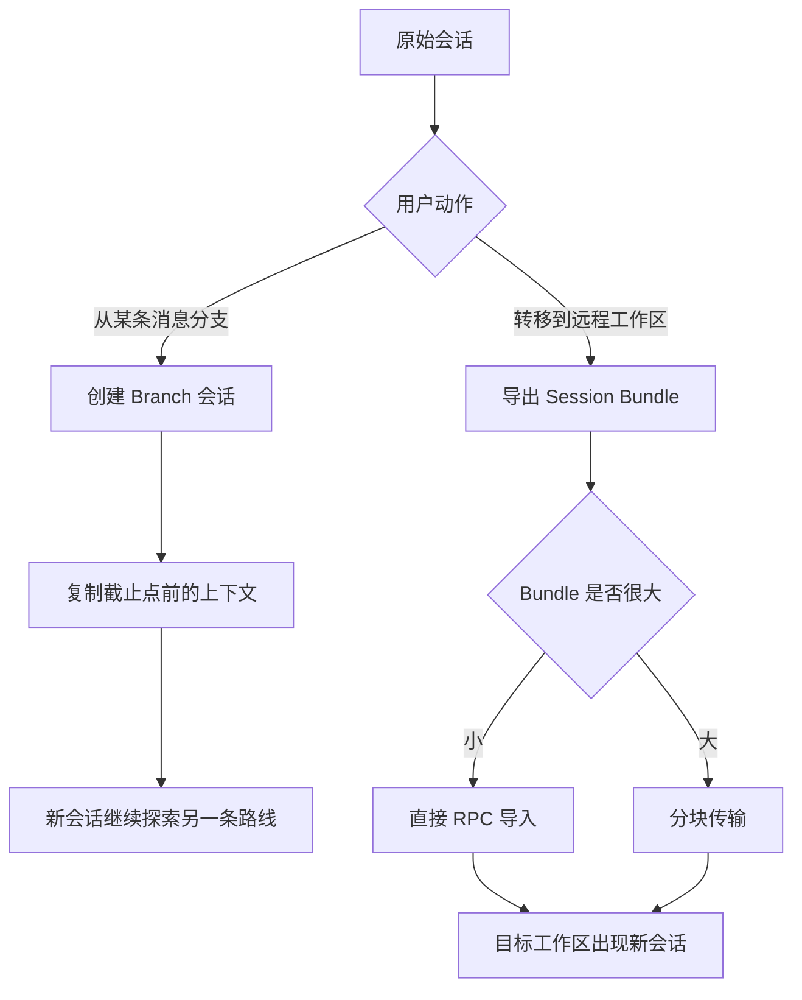

## 会话生命周期中的关键体验点

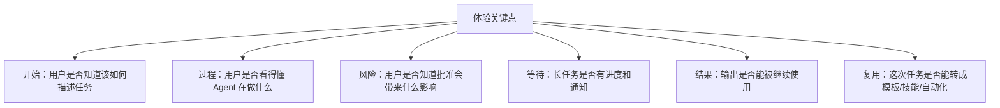

## 产品指标建议

| 阶段 | 可观察指标 | 代表什么 |
| --- | --- | --- |
| 创建会话 | 新会话数、首条消息发送率 | 用户是否成功开始任务 |
| 执行过程 | 工具调用数、权限请求批准率 | Agent 是否真的在行动，用户是否信任 |
| 中断点 | plan 修改率、auth 失败率、permission 拒绝率 | 哪里需要更清楚的解释 |
| 完成 | complete 率、error 率、cancel 率 | 任务完成质量 |
| 沉淀 | 标签/状态使用率、归档率、分享率 | 会话是否变成可管理资产 |
| 复用 | branch 数、automation 创建数、skill 创建数 | 用户是否从一次性使用走向复用 |

## 本文结论

会话生命周期可以被理解为：

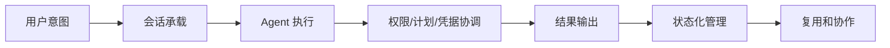

