# 03. Sources、Tools、Skills：Agent 为什么能做真实业务

## 三个概念先讲清楚

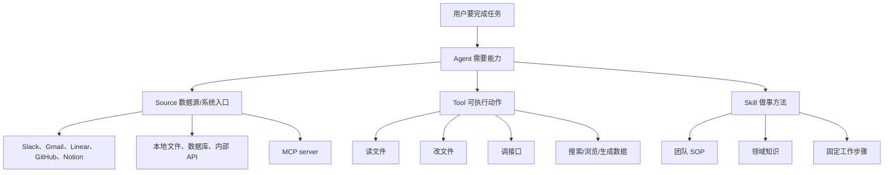

一句话区别：

- Source 解决“Agent 能接触哪些业务系统和数据”。
- Tool 解决“Agent 能实际做哪些动作”。
- Skill 解决“Agent 应该按什么方法做事”。

## 能力从哪里来

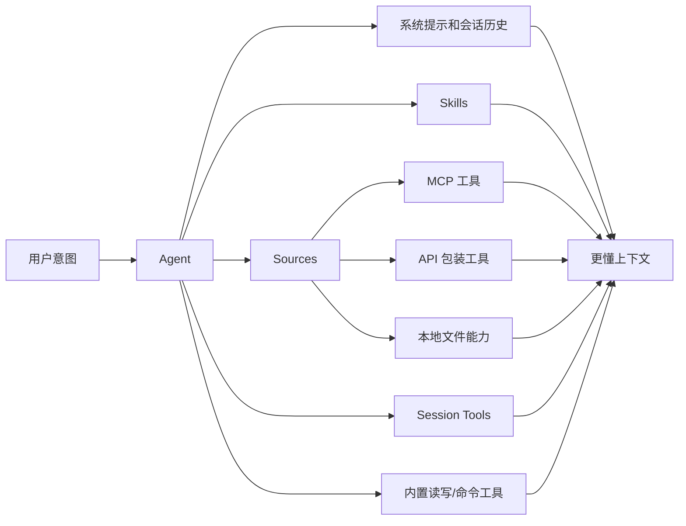

## Source 的生命周期

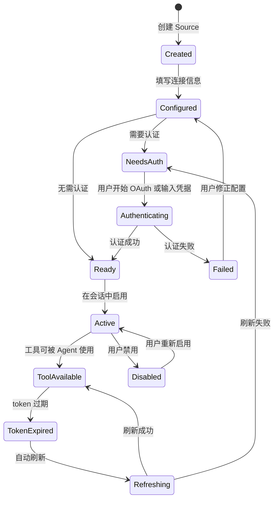

产品上，Source 生命周期对应一组关键体验：

- 创建是否简单。
- 认证是否顺畅。
- 出错时是否知道如何修复。
- 启用后 Agent 是否知道怎么用。
- token 过期是否自动恢复。

## Source 接入类型

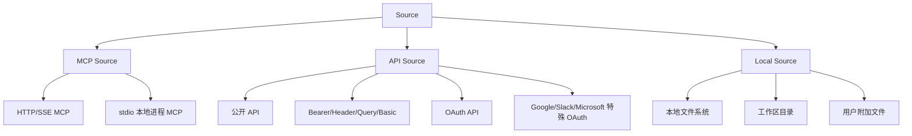

## Source 从配置到工具可用

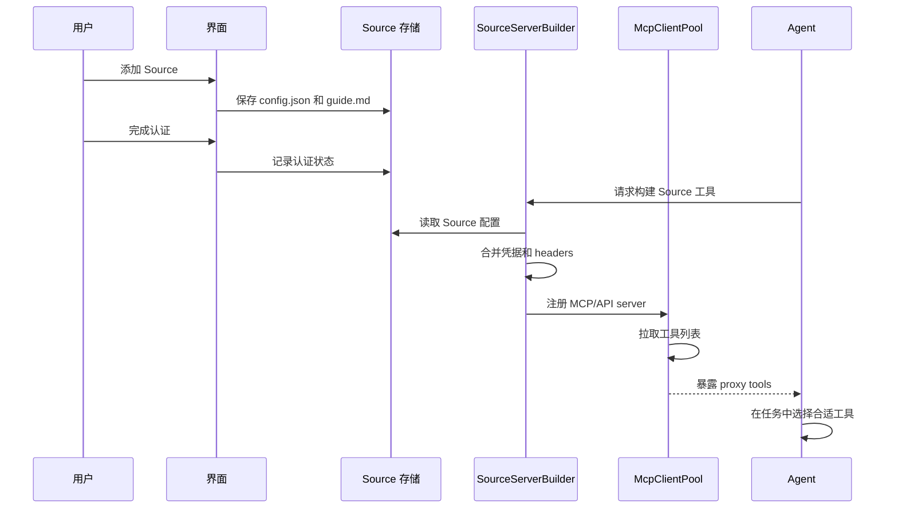

## 工具调用路径

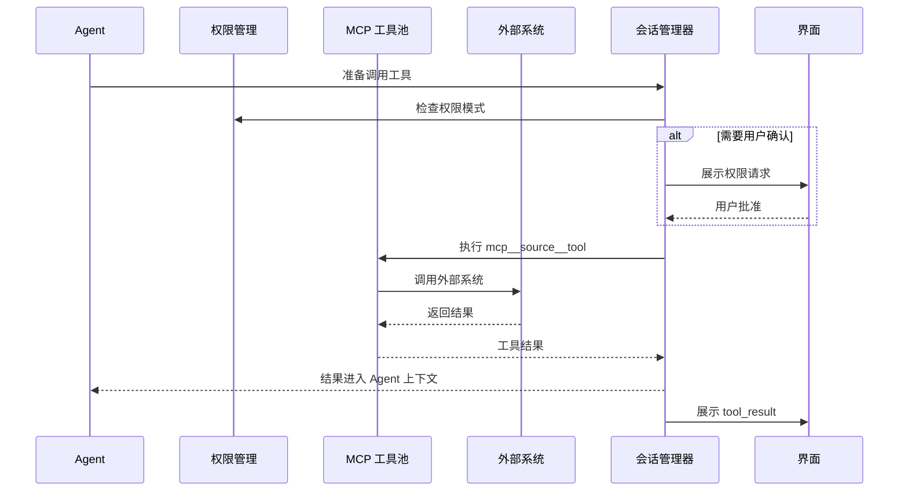

## Skill 的产品含义

Skill 可以理解为“给 Agent 的业务培训材料”。它通常不是工具本身，而是告诉 Agent：

- 这个领域怎么判断好坏。
- 做某类任务时要按什么步骤。
- 有哪些内部术语。
- 哪些坑不能踩。
- 输出格式应该是什么。

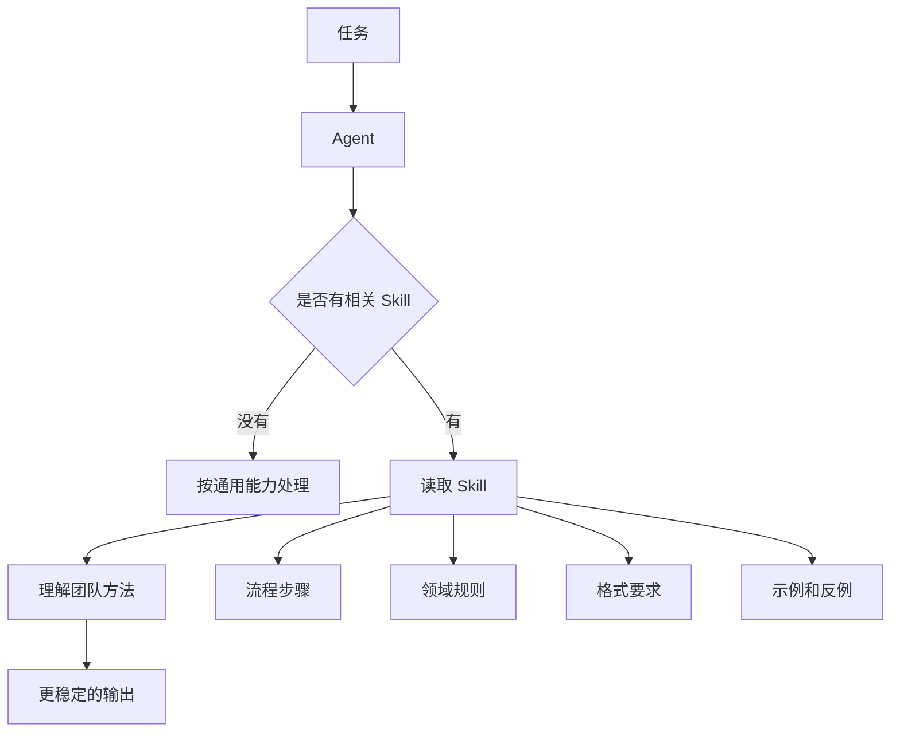

## Source Guide 的作用

每个 Source 可以带 `guide.md`。它像“使用说明书”，告诉 Agent：

- 这个 Source 是什么。
- 什么时候应该用。
- 调用前要知道哪些限制。
- 输出应该如何解释。

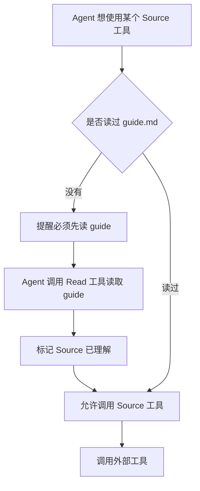

业务价值：

- 降低 Agent 误用外部系统的概率。
- 让团队可以把“使用边界”写进文档。
- 给非技术用户提供一种可维护的控制方式。

## Session Tools 是什么

Session Tools 是系统给 Agent 的“自管理工具”。它们不是连接外部业务系统，而是帮助 Agent 管理当前任务。

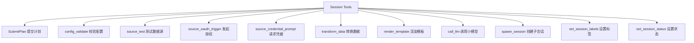

从产品角度看，Session Tools 让 Agent 不只是“执行任务”，还可以“组织任务”。

## Agent 能力增强路径

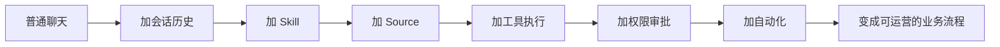

## 典型业务场景

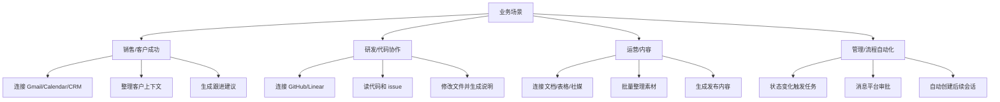

## 产品经理值得挖的点

| 方向 | 可问的问题 | 可能机会 |
| --- | --- | --- |
| Source 市场 | 用户最想连哪些系统？ | 官方模板、推荐连接、行业包 |
| Source 诊断 | 为什么 Source 配不成功？ | 连接体检、错误修复向导 |
| Skill 沉淀 | 成功会话能否转 Skill？ | 一键沉淀 SOP |
| Tool 透明度 | 用户是否看懂工具做了什么？ | 更好的工具卡片、影响预览 |
| Guide 体验 | 非技术用户会不会写 guide？ | 可视化 guide builder |
| 权限策略 | 哪些工具常被拒绝？ | 更细颗粒的权限模板 |

## 本文结论

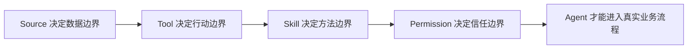

