# 04. 远程、多端与协作：为什么不只是一个桌面 App

## 产品视角

Craft Agents 支持 Electron 桌面端、Web UI、CLI、Viewer、远程 server。它的业务意义是：用户可以在不同场景下用同一套会话能力，而不是被固定在一个本地聊天窗口里。

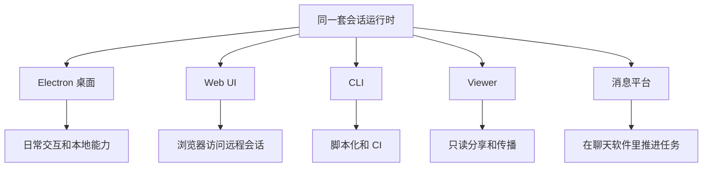

## 本地模式与远程模式

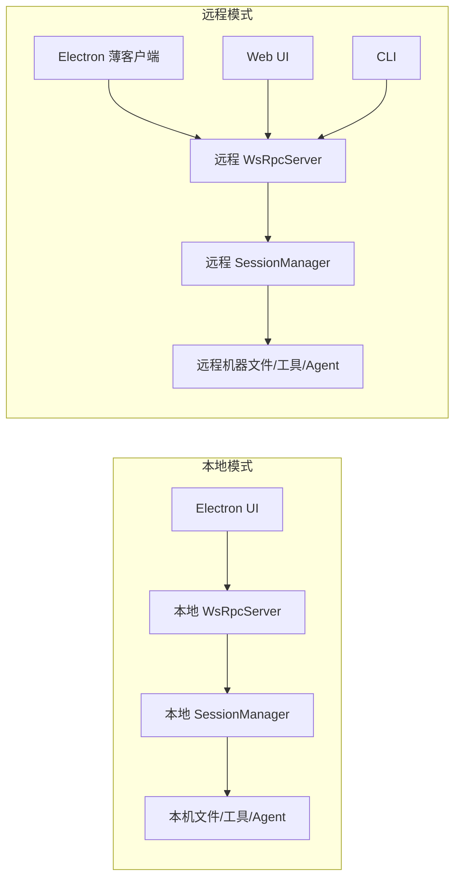

本地适合：

- 需要本机文件和桌面交互。
- 个人日常使用。
- 本机环境就是任务执行环境。

远程适合：

- 长时间任务。
- 多设备访问。
- 更强机器执行。
- 团队共享 server。
- Docker/服务器部署。

## 混合工作区路由

Electron 本地模式下，一个用户可以同时拥有本地工作区和远程工作区。系统通过 channel routing 判断请求应该去哪。

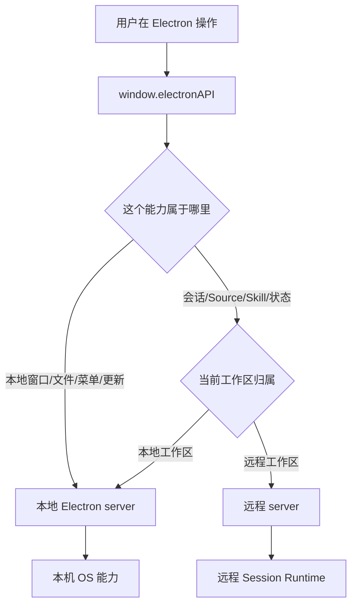

对产品经理来说，这意味着一个重要原则：

> “打开窗口、选择本地文件”这类事情发生在用户电脑；“执行远程任务、读取远程工作区文件”发生在远程 server。

## 多端入口的业务定位

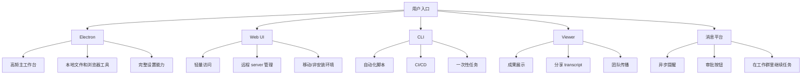

## 远程 server 的启动和访问

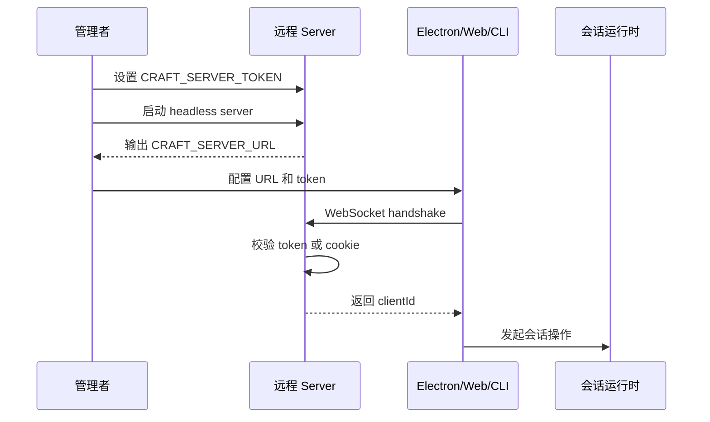

## Web UI 的业务意义

Web UI 不是单独产品线，而是远程 server 的浏览器入口。

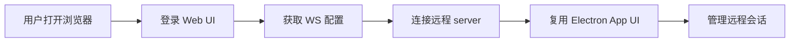

价值：

- 不安装桌面端也能看远程任务。
- 适合临时访问。
- 适合移动设备和受限环境。
- 可以作为团队 server 的入口。

限制：

- 本地文件打开、桌面通知、系统菜单等能力需要降级。
- 文件选择和 OAuth 行为需要浏览器替代方案。

## CLI 的业务意义

CLI 让 Craft Agents 从“交互工具”变成“可脚本化能力”。

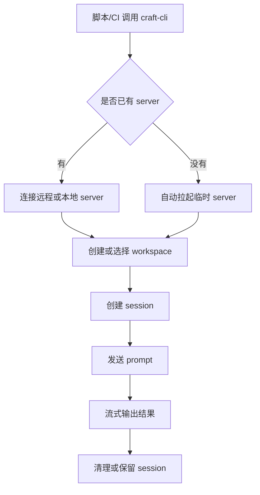

适合场景：

- CI 中生成报告。
- 批量检查项目。
- 每天定时跑一次分析。
- 与其他系统脚本串联。

## Viewer 与分享

Viewer 是只读会话展示，不参与执行。

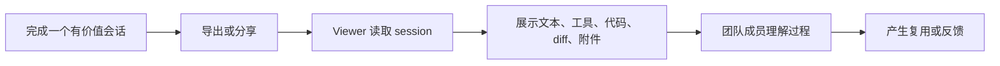

产品价值：

- 把 Agent 执行过程变成可传播案例。
- 帮团队理解“结果是怎么来的”。
- 降低新用户学习成本。
- 可以作为营销/支持/内部知识库材料。

## 会话转移

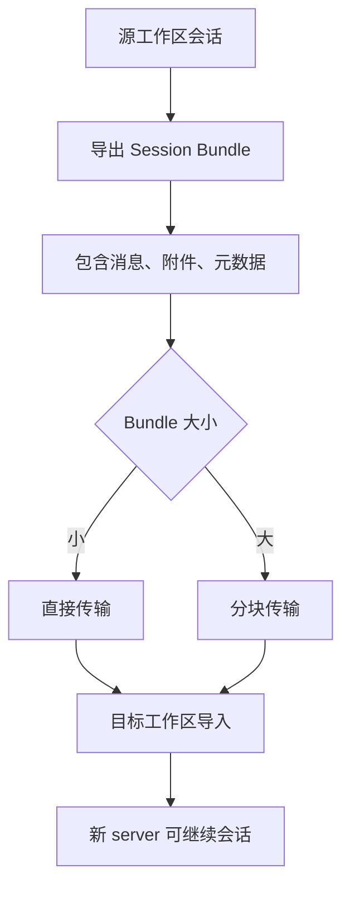

业务含义：

- 用户可以把本地探索转移到远程执行。
- 团队可以迁移重要会话。
- 长任务不被单台电脑限制。

## 协作模式

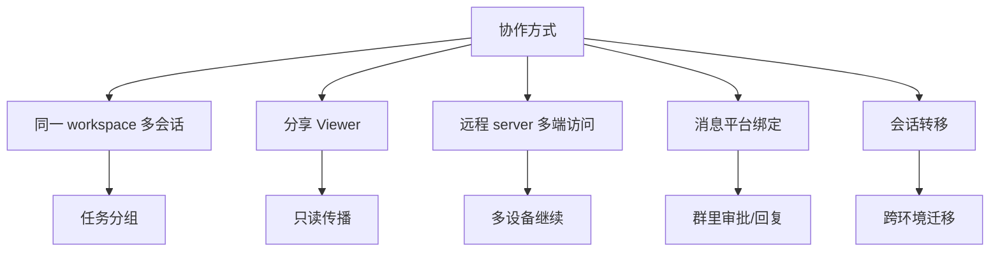

## 产品经理值得挖的点

| 方向 | 关键问题 | 产品机会 |
| --- | --- | --- |
| 远程 server | 用户为什么需要远程？ | 长任务、团队 server、云托管 |
| Web UI | 哪些功能必须浏览器可用？ | 轻量管理台、移动端审批 |
| CLI | 哪些任务适合脚本化？ | 模板命令、CI 集成 |
| Viewer | 分享后谁会看？ | 团队案例库、可公开分享页 |
| 会话迁移 | 用户什么时候想转移？ | 本地到远程一键迁移 |
| 多端一致性 | 不同入口体验是否一致？ | 统一导航、状态同步 |

## 本文结论

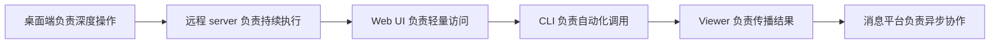

