# 05. 自动化与消息平台：如何把 Agent 从聊天框变成业务流程

## 给产品经理的一句话

自动化让 Craft Agents 不再只是“用户打开应用后问一句”，而是可以在业务事件发生时自动创建会话、发送提示词、调用 webhook，并通过 Telegram、WhatsApp、Lark 等消息平台把结果和审批推回用户正在工作的地方。

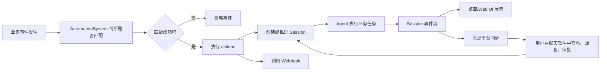

## 为什么这是一个重要业务拐点

普通 Agent 产品的使用方式是“人主动找 Agent”。自动化和消息平台让产品变成“业务事件主动找 Agent，再由 Agent 找人确认”。

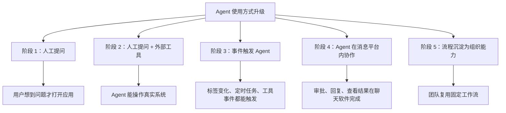

## 自动化系统的核心对象

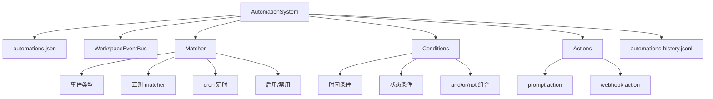

面向产品经理，可以这样理解：

| 对象 | 业务含义 | 例子 |
| --- | --- | --- |
| Event | 发生了一件事 | 会话状态变为 Needs Review |
| Matcher | 要不要响应这件事 | 只匹配带有 customer 标签的会话 |
| Condition | 响应前再做一层判断 | 只在工作日 9:00 到 18:00 触发 |
| Action | 匹配后做什么 | 创建 Agent 会话或调用 webhook |
| History | 自动化执行记录 | 用于排错、审计、运营分析 |

## 自动化事件类型

系统里事件大致分为 App 事件和 Agent 事件。

```mermaid
flowchart TD
  E["AutomationEvent"] --> APP["App 事件"]
  E --> AG["Agent 事件"]

  APP --> A1["LabelAdd 添加标签"]
  APP --> A2["LabelRemove 移除标签"]
  APP --> A3["LabelConfigChange 标签配置变化"]
  APP --> A4["PermissionModeChange 权限模式变化"]
  APP --> A5["FlagChange 置顶/重要变化"]
  APP --> A6["SessionStatusChange 会话状态变化"]
  APP --> A7["SchedulerTick 定时器触发"]

  AG --> G1["SessionStart 会话开始"]
  AG --> G2["UserPromptSubmit 用户提交 prompt"]
  AG --> G3["PreToolUse 工具调用前"]
  AG --> G4["PostToolUse 工具调用后"]
  AG --> G5["PostToolUseFailure 工具调用失败"]
  AG --> G6["PermissionRequest 权限请求"]
  AG --> G7["SessionEnd 会话结束"]
  AG --> G8["Notification 通知"]
  AG --> G9["PreCompact 压缩上下文前"]
```

产品上最值得关注的事件不是所有事件，而是能表达真实业务节点的事件：

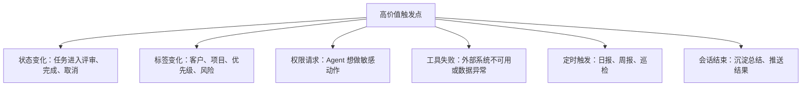

## 自动化配置如何被执行

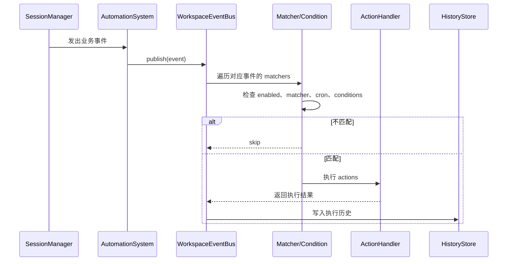

## 自动化状态机

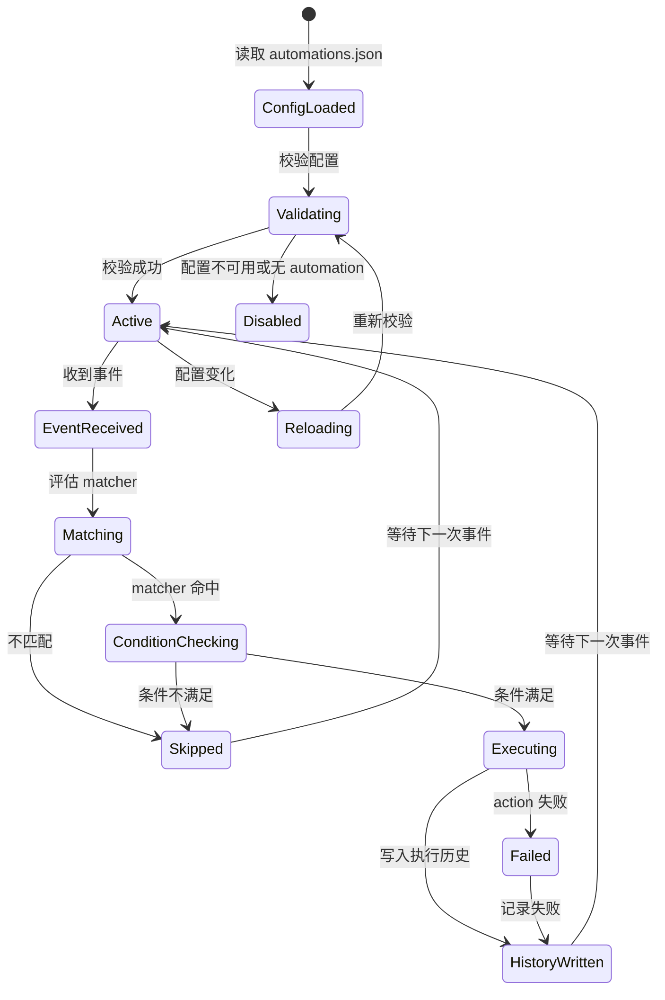

这里的核心产品原则是：自动化失败不能拖垮主流程。用户正在进行的会话要继续，自动化失败应该进入历史和提示，而不是让 Agent 主任务崩掉。

## Matcher、Condition、Action 的决策树

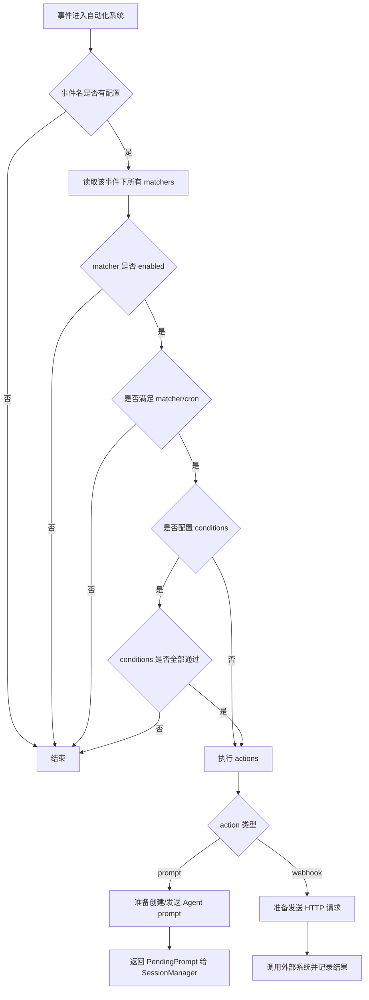

## 条件系统如何表达业务规则

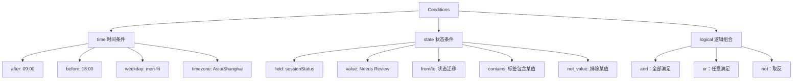

一个产品经理容易理解的例子：

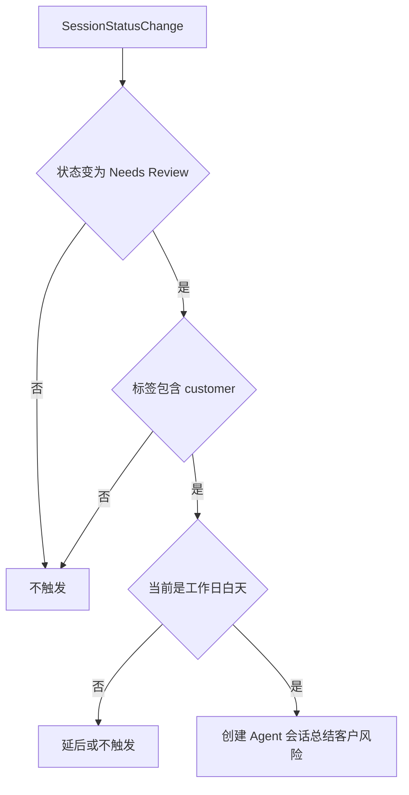

## Prompt Action：把事件变成新会话

Prompt Action 的业务意义是：某个事件发生后，系统自动让 Agent 执行一段预设任务。

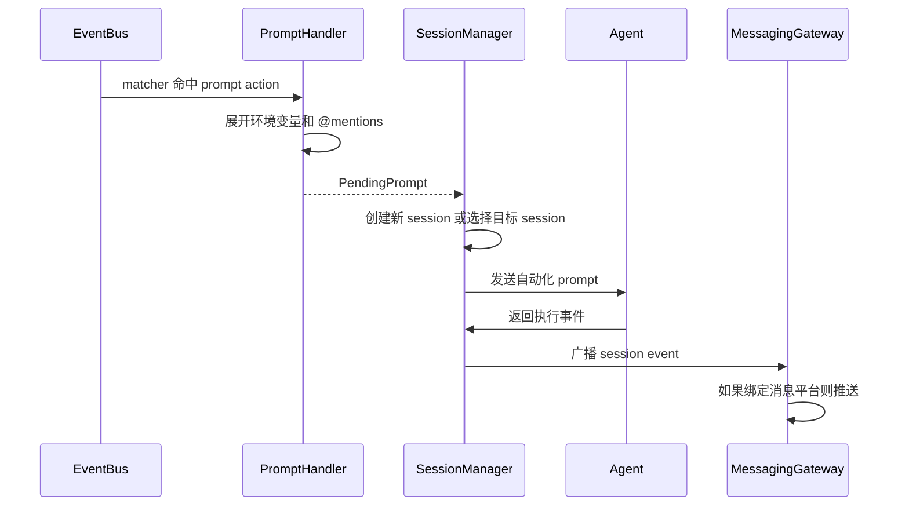

Prompt Action 可挖的产品价值：

- 可以把高频 SOP 做成自动执行。
- 可以把会话状态流转变成下一步动作。
- 可以通过标签把不同业务线分流。
- 可以用 `@source` 和 `@skill` 让自动任务带上特定能力。

## Webhook Action：把 Agent 事件告诉外部系统

Webhook Action 的业务意义是：Craft Agents 不只接收外部事件，也能把内部事件推给外部系统。

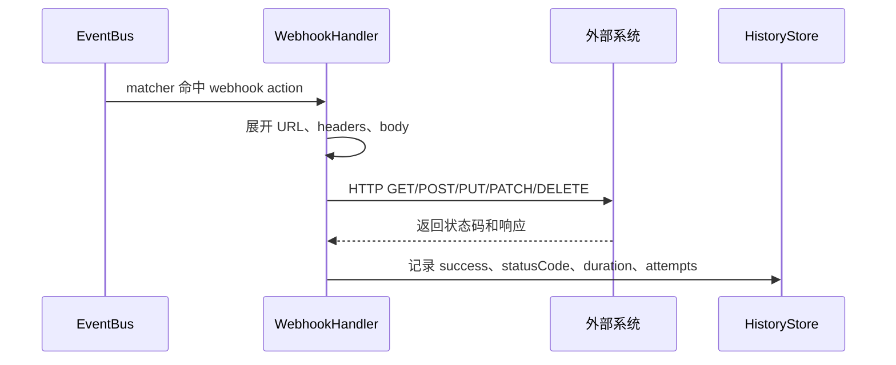

典型场景：

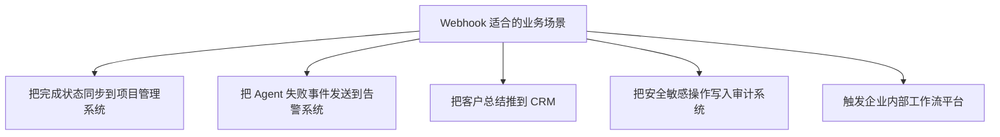

## 定时任务：从被动响应到主动巡检

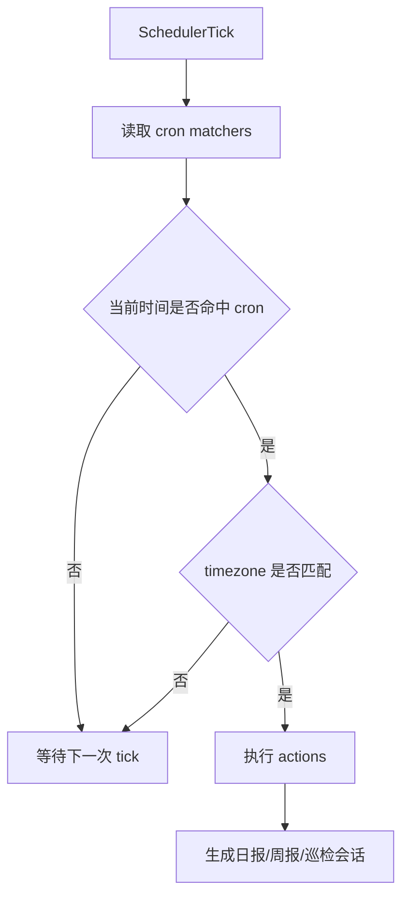

定时任务非常适合产品化成模板：

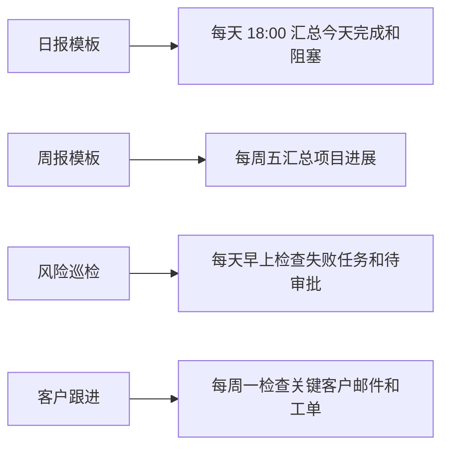

## 消息平台总体架构

消息平台是另一个入口。它既可以接收用户在外部聊天软件里的消息，也可以把会话执行过程发出去。

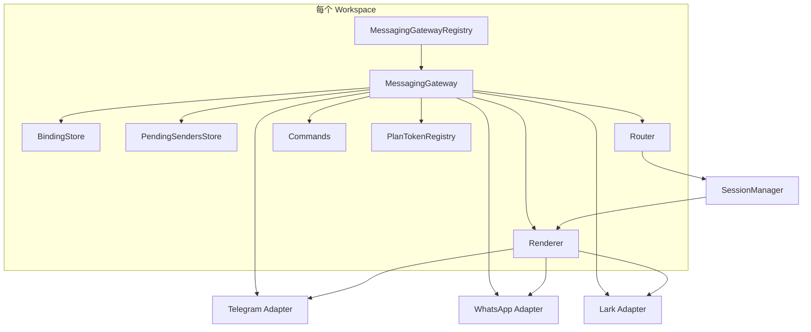

## 消息平台中的核心对象

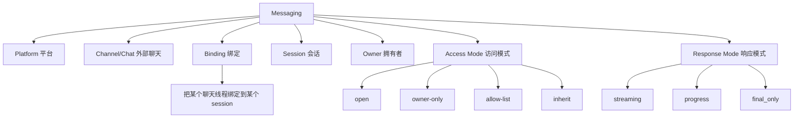

## 外部消息如何进入会话

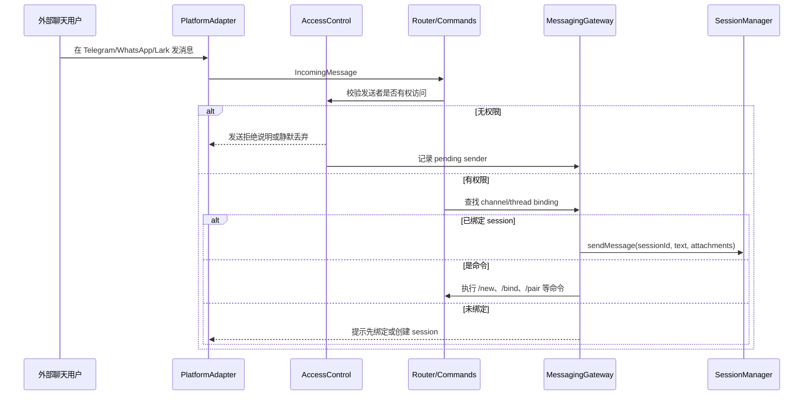

## Session 事件如何推回消息平台

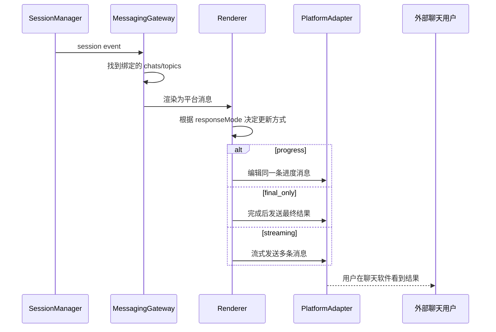

## Plan 和 Permission 的按钮审批

消息平台里最有产品价值的不是“转发消息”，而是让用户在外部聊天软件里完成关键审批。

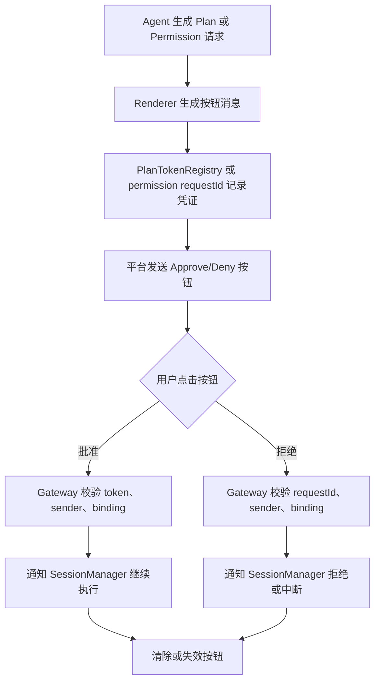

这个机制让长任务可以脱离桌面 App 持续推进：

```mermaid
journey
  title 用户在通勤中审批远程 Agent 任务
  section 任务执行
    Agent 远程运行: 4: Agent
    发现需要批准计划: 3: Agent
  section 外部触达
    Telegram 收到计划摘要: 5: 用户
    用户点击批准按钮: 5: 用户
  section 任务继续
    Agent 继续执行: 4: Agent
    最终结果推送到聊天: 5: 用户
```

## 访问控制是消息平台的生命线

```mermaid
flowchart TD
  A["收到外部刺激"] --> B{"sender 是否是 bot"}
  B -->|是| X["静默丢弃，避免机器人互刷"]
  B -->|否| C{"是绑定前命令吗"}
  C -->|是| D{"workspace accessMode"}
  D -->|open| OK["允许"]
  D -->|owner-only| E{"sender 是否 owner"}
  E -->|是| OK
  E -->|否| DENY["拒绝并记录 pending sender"]

  C -->|否，路由到已有 binding| F{"binding accessMode"}
  F -->|open| OK
  F -->|allow-list| G{"sender 在 allowedSenderIds 吗"}
  G -->|是| OK
  G -->|否| DENY
  F -->|inherit| D
```

从业务上看，消息访问控制和 Agent 工具权限是两条线：

```mermaid
flowchart LR
  A["消息访问控制"] --> A1["谁能从聊天软件控制会话"]
  B["Agent 工具权限"] --> B1["Agent 能不能执行写操作或敏感工具"]

  A1 --> C["防止外部人乱发指令"]
  B1 --> D["防止 Agent 未经批准修改系统"]
```

## WhatsApp Worker 为什么独立

WhatsApp 依赖更复杂，系统用独立 worker 子进程隔离它。

```mermaid
sequenceDiagram
  participant AD as WhatsAppAdapter
  participant WK as WhatsApp Worker
  participant WA as WhatsApp Network

  AD->>WK: WorkerCommand NDJSON
  WK->>WA: 连接、登录、收发消息
  WA-->>WK: incoming、QR、pairing、send result
  WK-->>AD: WorkerEvent NDJSON
  AD->>AD: 转成 Gateway 事件
```

业务价值：

- WhatsApp 连接异常不影响主应用。
- 登录、重连、附件下载可以隔离处理。
- 子进程协议稳定后，平台适配可独立迭代。

## Telegram Topic 与自动化的结合

自动化配置可以指定 Telegram forum topic。这样某类自动化生成的会话可以自动进入一个固定讨论区。

```mermaid
flowchart TD
  A["自动化 matcher 命中"] --> B{"配置 telegramTopic 吗"}
  B -->|否| C["创建普通自动化 session"]
  B -->|是| D{"是否已绑定 Telegram supergroup"}
  D -->|否| C
  D -->|是| E{"topic 是否存在"}
  E -->|不存在| F["创建 forum topic"]
  E -->|已存在| G["复用 topic"]
  F --> H["绑定 session 到该 topic"]
  G --> H
  H --> I["后续进度推送到同一 topic"]
```

产品机会：

- 客户自动化进入“客户风险”话题。
- 研发自动化进入“构建失败”话题。
- 销售自动化进入“待跟进线索”话题。

## 典型业务剧本

### 剧本 1：会话进入评审后自动总结

```mermaid
flowchart TD
  A["会话状态变为 Needs Review"] --> B["Automation 匹配 SessionStatusChange"]
  B --> C["条件：标签包含 product"]
  C --> D["Prompt Action：总结本次任务变更、风险、待确认点"]
  D --> E["创建新 Agent 会话"]
  E --> F["结果推送到 Telegram 产品评审 topic"]
  F --> G["PM 在群里继续追问"]
```

### 剧本 2：工具失败后自动告警

```mermaid
flowchart TD
  A["Agent 调用 GitHub 工具失败"] --> B["PostToolUseFailure"]
  B --> C["Automation 匹配失败事件"]
  C --> D["Webhook Action 推送到告警系统"]
  C --> E["Prompt Action 创建排查会话"]
  E --> F["Agent 分析失败原因"]
  F --> G["消息平台通知负责人"]
```

### 剧本 3：每天自动生成团队日报

```mermaid
flowchart TD
  A["每天 18:00 SchedulerTick"] --> B["cron 命中"]
  B --> C["Prompt Action"]
  C --> D["Agent 读取今天完成的 sessions"]
  D --> E["汇总完成项、阻塞项、需要人工审批项"]
  E --> F["发送到团队群"]
```

## 产品指标建议

```mermaid
flowchart TD
  ROOT["自动化与消息指标"] --> A["配置指标"]
  ROOT --> B["触发指标"]
  ROOT --> C["执行指标"]
  ROOT --> D["协作指标"]
  ROOT --> E["安全指标"]

  A --> A1["automation 数量"]
  A --> A2["启用率"]
  A --> A3["模板使用率"]

  B --> B1["事件触发次数"]
  B --> B2["matcher 命中率"]
  B --> B3["condition 拦截率"]

  C --> C1["action 成功率"]
  C --> C2["prompt session 完成率"]
  C --> C3["webhook 成功率和耗时"]

  D --> D1["消息绑定数"]
  D --> D2["外部回复数"]
  D --> D3["按钮审批率"]

  E --> E1["拒绝访问次数"]
  E --> E2["pending sender 数"]
  E --> E3["重复按钮点击拦截数"]
```

## 产品上值得继续深挖的点

```mermaid
flowchart TD
  ROOT["机会点"] --> A["自动化模板市场"]
  ROOT --> B["可视化自动化编辑器"]
  ROOT --> C["自动化运行历史和调试台"]
  ROOT --> D["消息平台审批中心"]
  ROOT --> E["按团队/角色配置访问控制"]
  ROOT --> F["失败自动重试和人工接管"]
  ROOT --> G["自动化效果分析"]

  A --> A1["日报、周报、客户跟进、失败巡检"]
  B --> B1["非技术用户不需要手写 JSON"]
  C --> C1["告诉用户为什么触发或没触发"]
  D --> D1["集中处理 Plan、Permission、Credential 提醒"]
  E --> E1["团队 owner、项目 owner、临时协作者"]
  F --> F1["失败后转为消息提醒或创建排查会话"]
  G --> G1["展示节省时间、完成率、阻塞点"]
```

## 本文结论

自动化和消息平台把 Craft Agents 从“一个会话工具”扩展成“业务流程执行层”。

```mermaid
flowchart LR
  A["事件"] --> B["自动化判断"]
  B --> C["Agent 执行"]
  C --> D["消息平台触达"]
  D --> E["用户审批/回复"]
  E --> C
  C --> F["结果沉淀"]
  F --> G["流程复用"]
```

