# 06. 信任、权限与安全：用户为什么敢把真实任务交给 Agent

## 给产品经理的一句话

Craft Agents 的安全设计不是一个单独的“安全设置页”，而是一整套让用户逐步建立信任的机制：权限模式、计划审批、工具审批、凭据加密、Source guide、消息访问控制、远程连接校验、审计日志一起构成了“可控的 Agent 执行边界”。

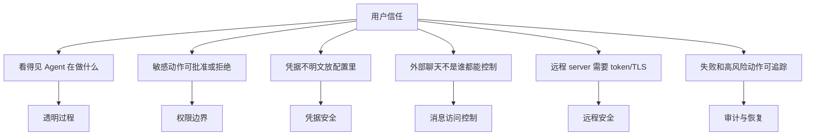

## 信任不是一次授权，而是逐级放权

用户一开始不会直接让 Agent 随便改系统。更自然的路径是：

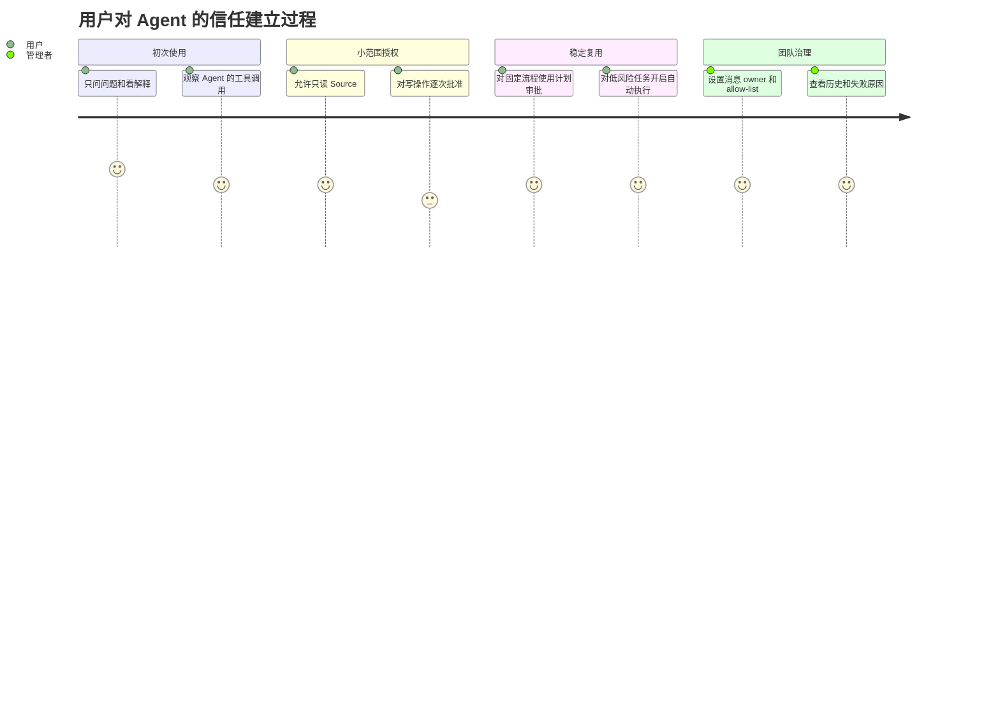

## 安全边界总览

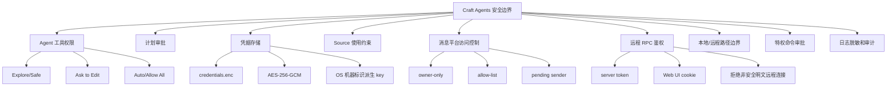

## 权限模式的产品含义

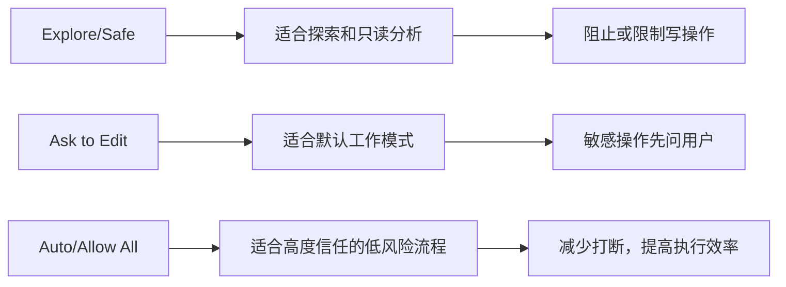

| 模式 | 用户心理 | 产品价值 | 风险 |
| --- | --- | --- | --- |
| Explore/Safe | 我先看看它能分析什么 | 降低初次使用门槛 | 任务完成度可能低 |
| Ask to Edit | 重要动作先问我 | 平衡效率和控制 | 频繁审批会打断 |
| Auto/Allow All | 这个流程我已经信任 | 适合自动化和批量任务 | 需要更强的范围控制 |

## 工具执行权限流

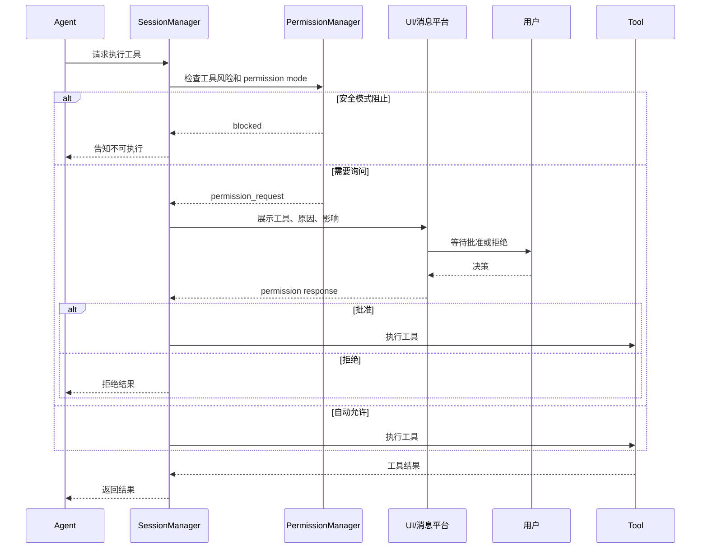

## 计划审批是“执行前对齐”

工具审批解决的是“这一刀能不能下”，计划审批解决的是“整件事是不是要这么做”。

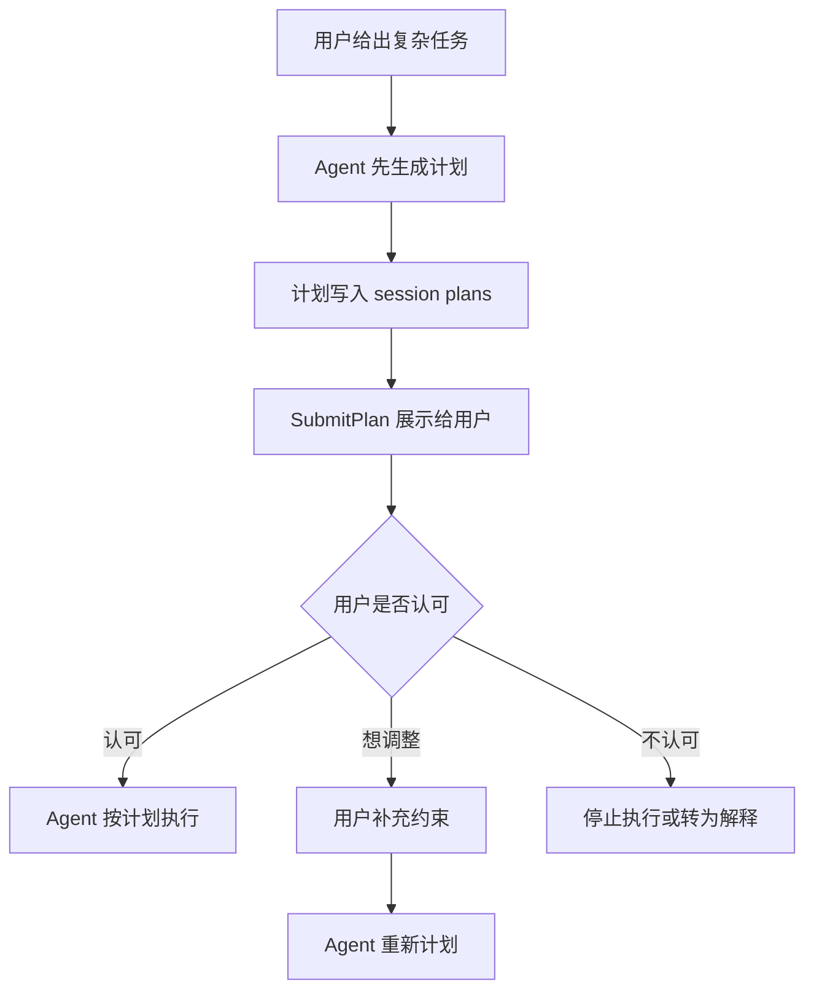

计划审批适合：

- 多步骤任务。
- 会修改多个文件或外部系统的任务。
- 团队协作中需要让别人理解的任务。
- 自动化生成的高风险任务。

## Source Guide 是柔性的安全控制

Source guide 不是代码层面的硬权限，但它是一种非常适合产品化的“业务边界说明”。

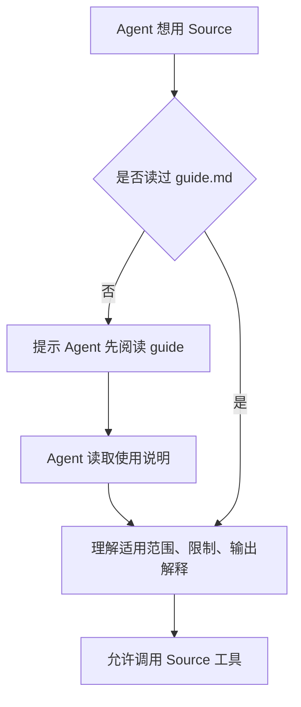

产品价值：

- 团队可以用自然语言写规则。
- 不需要每条边界都开发成代码。
- 让 Agent 在调用前知道“这个系统怎么用才对”。
- 适合沉淀业务 SOP 和外部 API 限制。

## 凭据分层：普通配置和敏感值分开

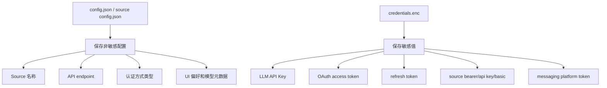

这样做的业务意义是：用户可以备份、迁移、查看配置，但不应该在普通配置文件里暴露 secret。

## 凭据类型地图

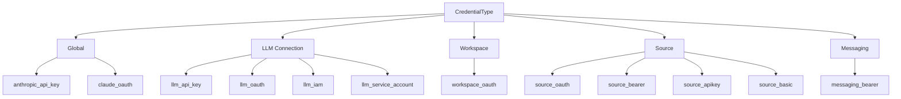

## OAuth 授权流程

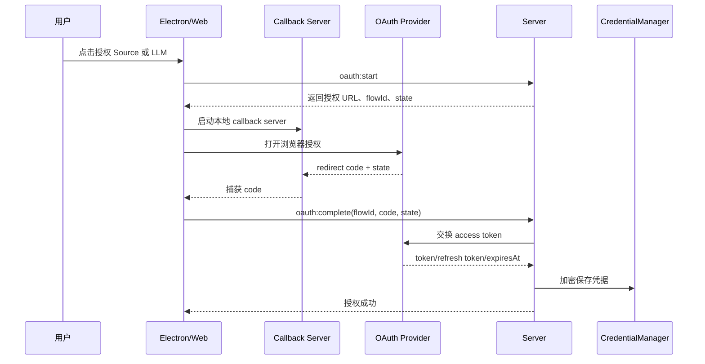

用户看见的是“跳浏览器授权再回来”，系统内部要保证：

- state 防止串流程。
- token 不进入普通配置。
- refresh token 用于续期。
- 失败后 Source 状态要能解释清楚。

## Token 过期与刷新

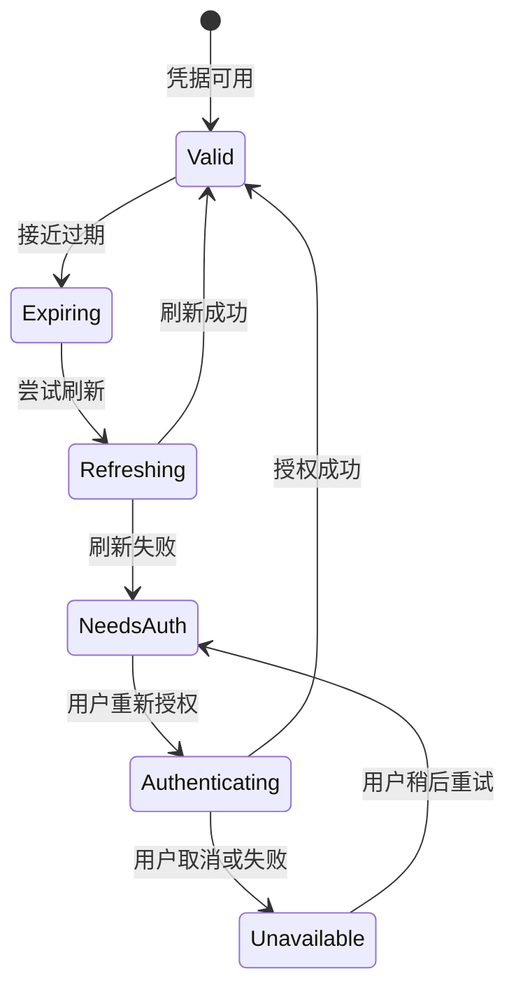

这里最重要的产品体验是：不要只告诉用户“失败”，要告诉用户“哪个 Source 的认证过期了、需要做什么”。

## 远程 RPC 安全

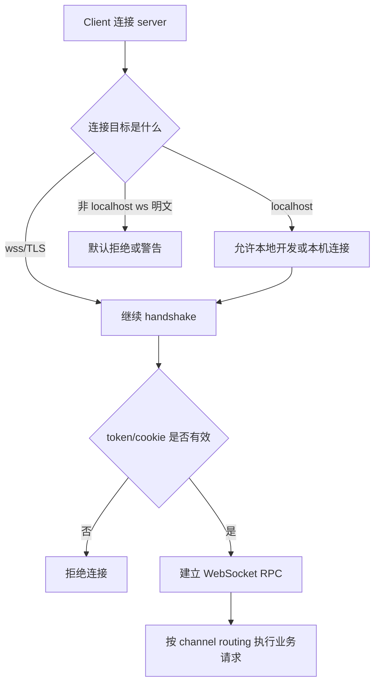

产品上的解释方式：

- 本机连接可以更宽松。
- 远程 server 必须有 token。
- 公网或局域网暴露时应该用 TLS。
- Electron 薄客户端不应该随便连非安全明文远程地址。

## 本地路径与远程路径不能混淆

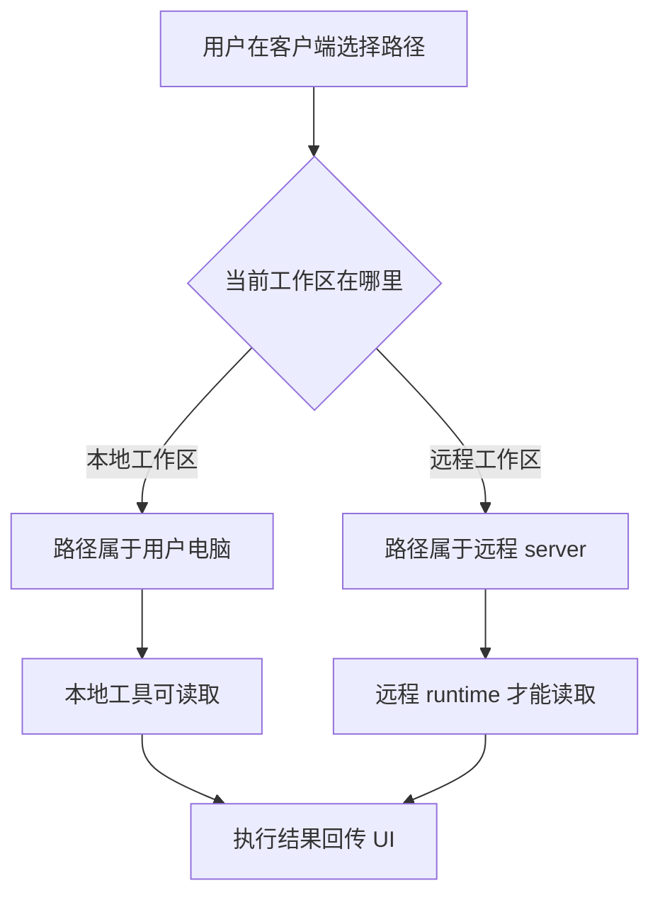

这是远程产品最容易让用户困惑的地方。文案和 UI 需要清晰区分“你电脑上的文件”和“远程机器上的文件”。

## 消息访问控制与工具权限是两层门

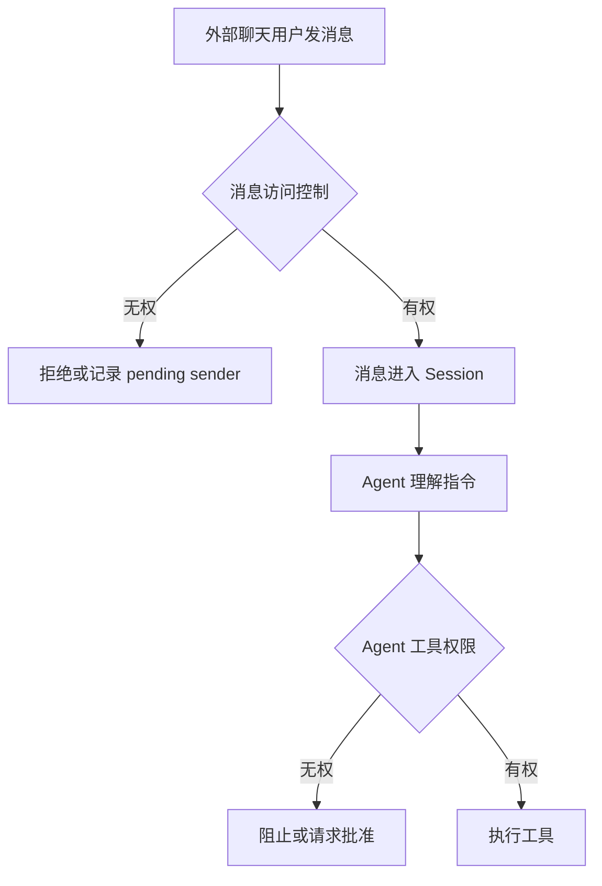

对用户解释：

- 消息访问控制回答“谁能进来发指令”。
- Agent 工具权限回答“进来之后 Agent 能做多大动作”。

## 消息平台访问控制矩阵

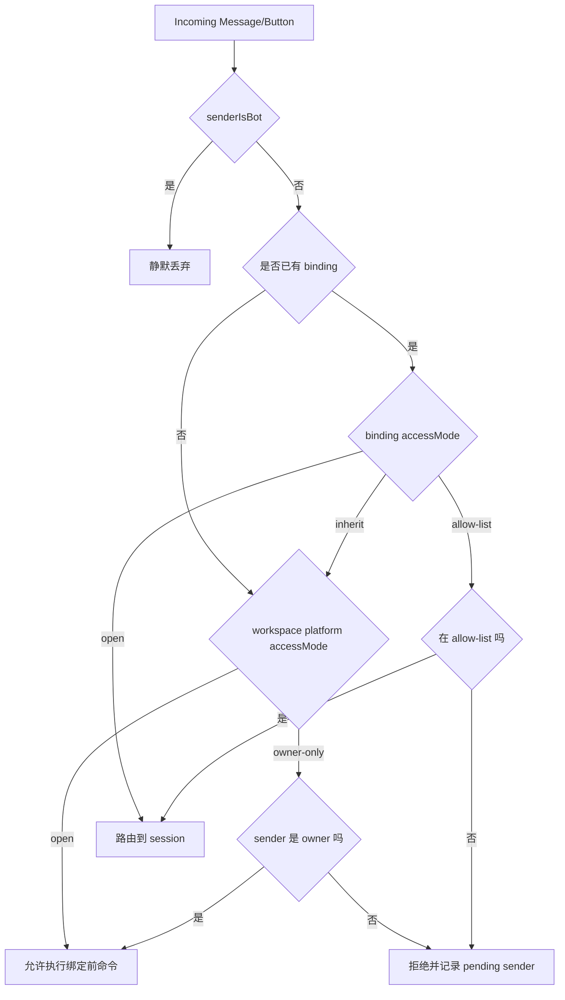

## 特权命令审批

某些命令即使用户授权了 Agent，也需要更强约束。系统中存在特权执行 broker，用于给高权限命令做审批、过期和审计。

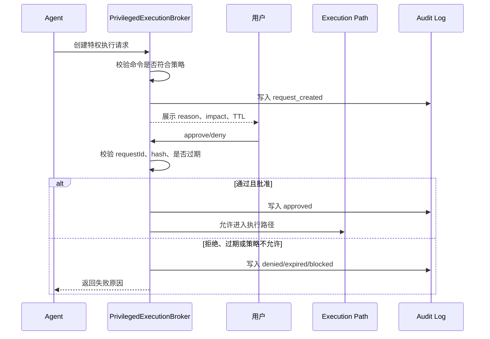

这里有一个很好的产品点：高风险操作不只问“是否批准”，还要展示“原因、影响、有效时间、命令摘要”。

## 数据存储边界

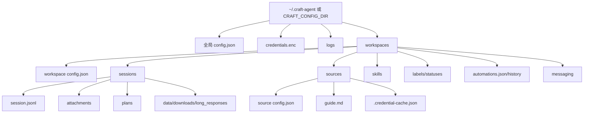

关键点：

- `session.jsonl` 便于追加和恢复。
- `credentials.enc` 是权威敏感凭据存储。
- Source 下的 `.credential-cache.json` 是给外部子进程使用的临时缓存，不是权威来源。
- logs 和 history 应该适合排错，但不能泄漏 token。

## 风险点和产品缓解策略

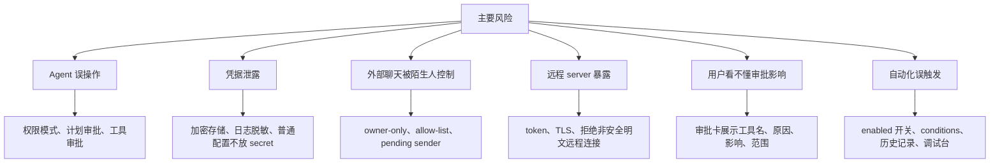

## 审批卡应该讲清楚什么

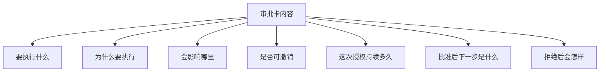

产品文案不应该只写“Allow”。更好的结构是：

| 字段 | 目的 |
| --- | --- |
| 工具名 | 让用户知道动作类型 |
| 目标对象 | 让用户知道影响范围 |
| Agent 理由 | 让用户知道为什么需要 |
| 预计影响 | 让用户评估风险 |
| 操作按钮 | 批准、拒绝、查看详情 |

## 失败恢复流程

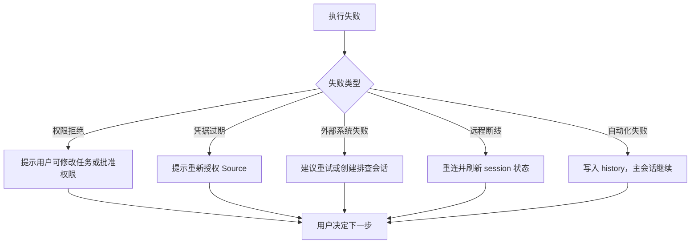

## 信任相关指标

```mermaid
flowchart TD
  ROOT["信任指标"] --> A["审批行为"]
  ROOT --> B["权限模式"]
  ROOT --> C["凭据健康"]
  ROOT --> D["远程连接"]
  ROOT --> E["消息访问"]
  ROOT --> F["失败恢复"]

  A --> A1["permission 批准率"]
  A --> A2["permission 拒绝率"]
  A --> A3["plan 修改率"]
  A --> A4["审批等待时长"]

  B --> B1["默认模式分布"]
  B --> B2["用户切到 Auto 的比例"]
  B --> B3["Auto 后失败率"]

  C --> C1["认证成功率"]
  C --> C2["token 刷新失败率"]
  C --> C3["credential health issue 数"]

  D --> D1["token handshake 失败数"]
  D --> D2["stale reconnect 次数"]
  D --> D3["远程任务完成率"]

  E --> E1["拒绝访问次数"]
  E --> E2["pending sender 转 owner/allow-list 比率"]
  E --> E3["按钮重复点击拦截数"]

  F --> F1["失败后重试率"]
  F --> F2["失败后继续完成率"]
```

## 本文结论

信任产品的核心不是“把所有风险藏起来”，而是把风险转成用户能理解、能决策、能追踪的流程。

```mermaid
flowchart LR
  A["透明"] --> B["可批准"]
  B --> C["可撤回或拒绝"]
  C --> D["可恢复"]
  D --> E["可审计"]
  E --> F["用户敢授权更多"]
  F --> A
```

