# 07. 产品机会地图：哪些点最值得继续挖

## 给产品经理的一句话

Craft Agents 的机会不只在“模型回答更聪明”，而在于把会话、工具、Source、Skill、权限、自动化、远程和消息平台组合成可复用的业务系统。最值得挖的是那些能让用户从“一次性提问”走向“可管理、可授权、可复用、可协作”的点。

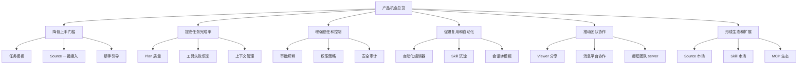

## 先看用户价值链

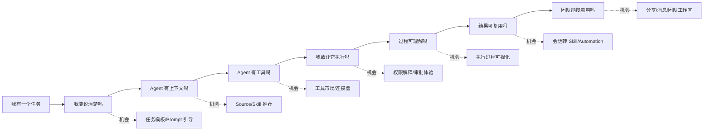

## 用户分层

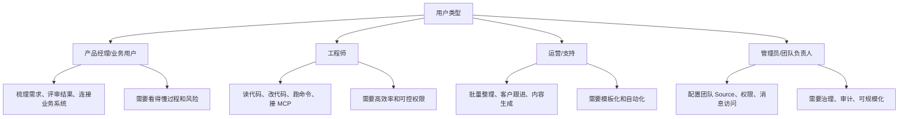

## 值得挖掘的 12 个方向

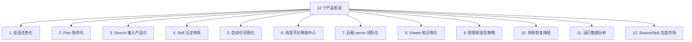

下面逐个拆。

## 机会 1：会话任务化

当前 Session 已经有标签、状态、置顶、归档、未读等能力。机会是把它从“聊天列表”进一步变成“轻量任务工作台”。

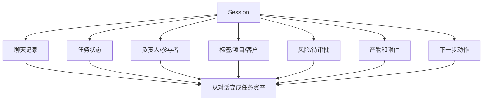

产品问题：

- 会话状态是否应该支持自定义流程？
- 会话列表是否可以切成看板视图？
- 是否需要“待我审批”“失败待处理”“今天完成”等智能筛选？

## 机会 2：Plan 协作化

Plan 现在是执行前的审批契约。进一步可以变成团队协作对象。

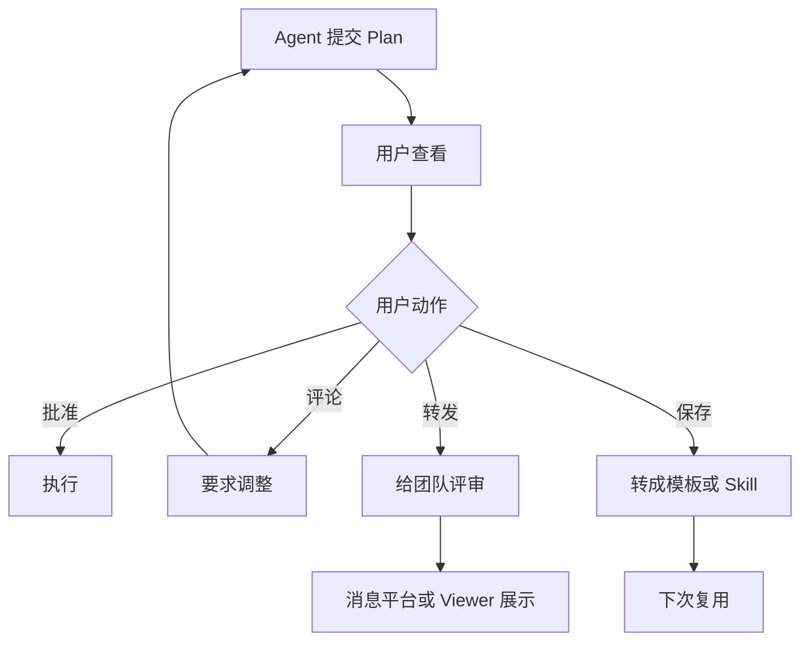

可做方向：

- Plan diff：本次计划和上次计划哪里不同。
- Plan comment：用户在某一步旁边留言。
- Plan template：高频计划保存成团队 SOP。
- Plan risk score：系统提示哪些步骤风险高。

## 机会 3：Source 接入产品化

Source 是 Agent 能力的入口。它越容易接入，Agent 越像“能在公司系统里干活的人”。

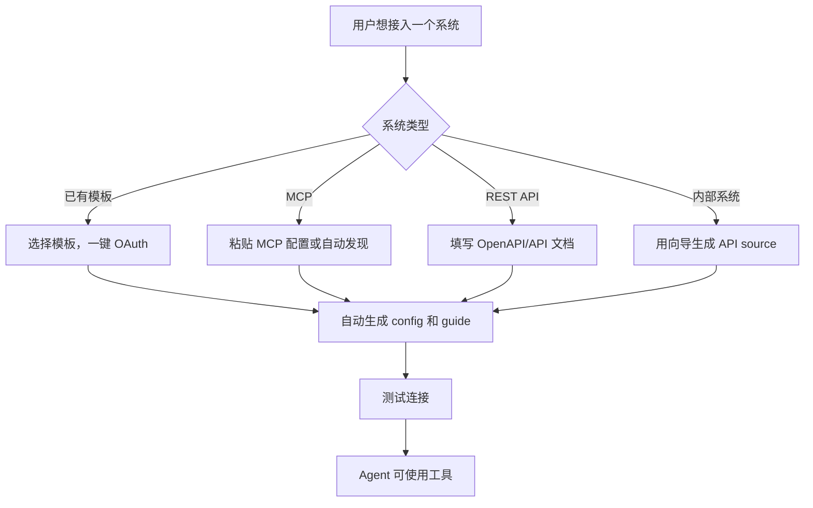

值得挖：

- 常见 Source 模板库：GitHub、Linear、Slack、Gmail、Notion、Jira。
- Source 健康页：认证、工具数量、最近失败。
- Source guide 生成器：根据 API 文档生成使用说明。
- Source 权限范围说明：让用户知道授权后能做什么。

## 机会 4：Skill 沉淀体系

Skill 是组织知识进入 Agent 的低门槛方式。产品上可以从“文件夹里的说明”升级成“团队知识资产”。

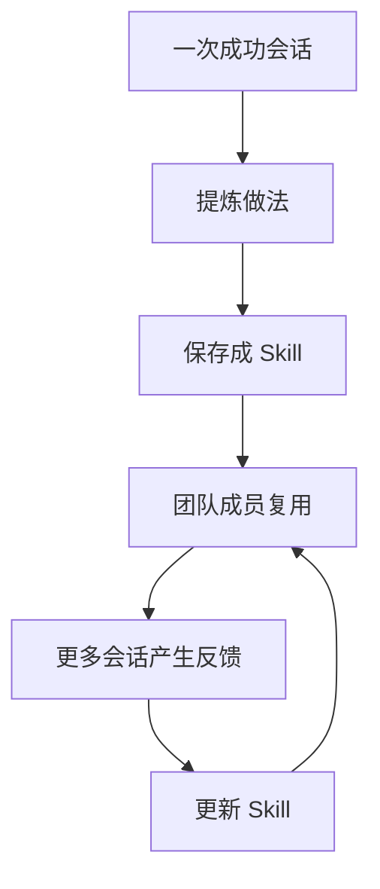

可做方向：

- 从会话一键生成 Skill 草稿。
- Skill 版本管理。
- Skill 命中率和效果评分。
- Skill 推荐：用户输入任务时推荐相关 Skill。
- Skill 审核：团队管理员批准后共享。

## 机会 5：自动化可视化

目前自动化配置偏工程化。对非技术用户来说，机会是把 Event、Matcher、Condition、Action 做成可视化搭建器。

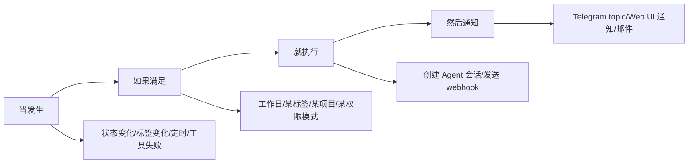

非技术用户看到的应该是：

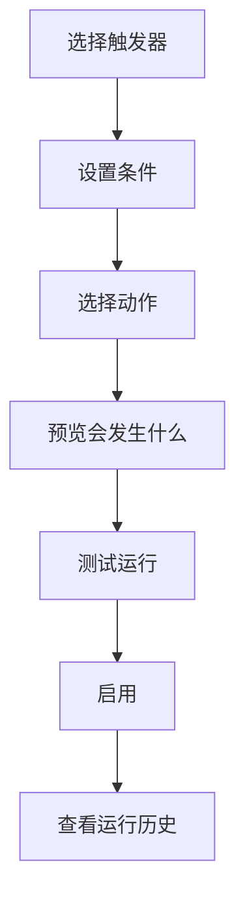

## 机会 6：消息平台审批中心

消息平台已经能承载 Plan 和 Permission 按钮。下一步可以做成“待处理事项中心”。

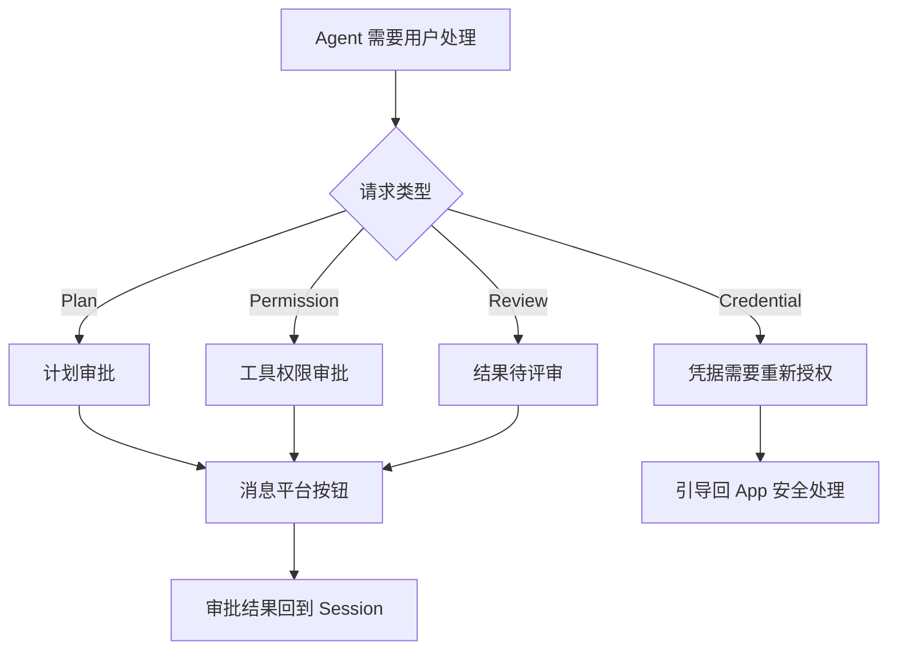

产品点：

- “所有待我审批”的列表。
- 移动端友好的审批摘要。
- 到期提醒和自动取消。
- 审批历史可追踪。

## 机会 7：远程 server 团队化

远程 server 的价值不只是“跑在另一台机器”，而是成为团队 Agent 工作基础设施。

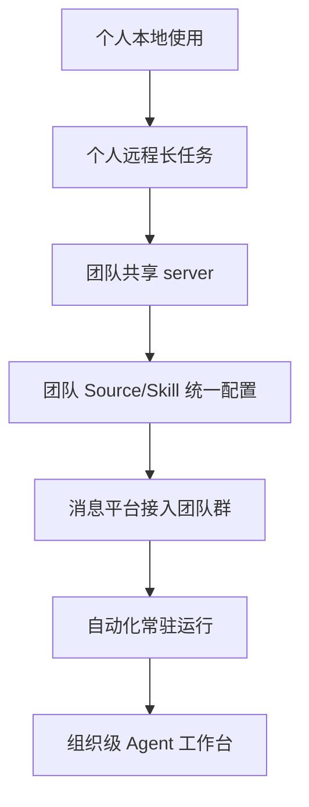

可挖方向：

- 团队 workspace 成员和角色。
- 远程任务队列和资源占用。
- 长任务通知和恢复。
- 团队默认 Source、Skill、权限策略。
- 管理员仪表盘。

## 机会 8：Viewer 知识库化

Viewer 是只读分享。继续发展可以成为“Agent 产出知识库”。

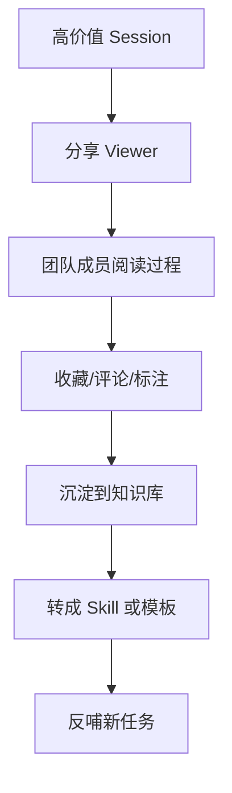

适合的内容：

- 需求分析过程。
- 代码改动解释。
- 客户问题排查。
- 竞品研究。
- 自动化运行案例。

## 机会 9：权限和安全策略

当前有基础权限模式。团队化之后，需要从“单次审批”发展到“策略管理”。

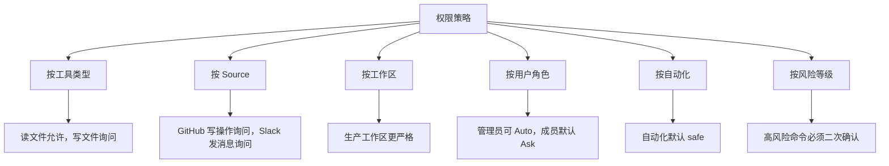

产品目标：让用户不是在每次弹窗里做重复判断，而是建立可解释的默认策略。

## 机会 10：失败恢复体验

Agent 失败并不可怕，可怕的是用户不知道下一步怎么办。

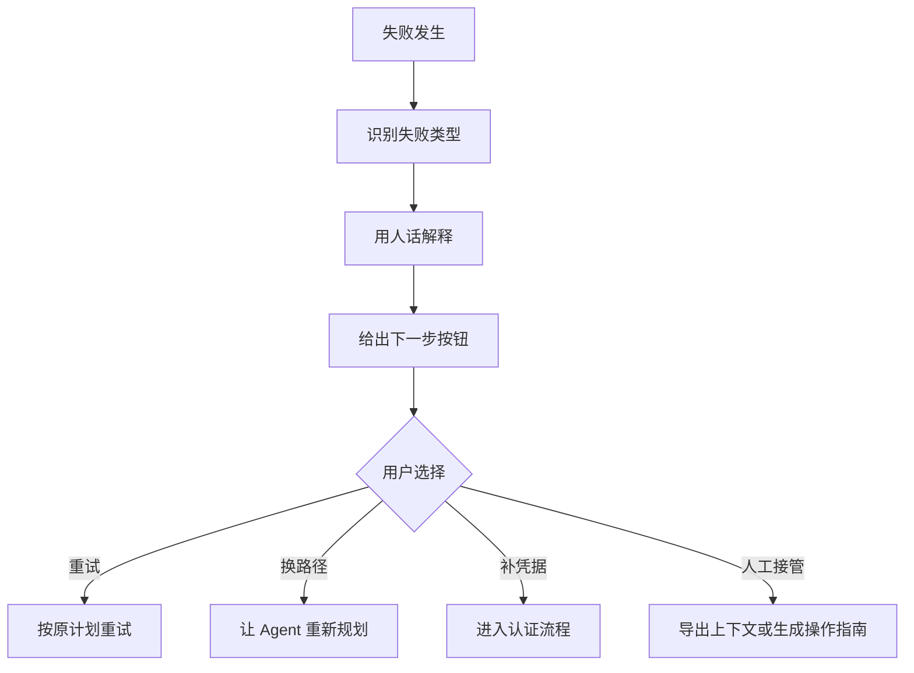

可做方向：

- 失败分类：权限、认证、工具、网络、模型、上下文过长。
- 一键重试。
- 自动生成排查会话。
- 失败后推荐更安全的替代路径。

## 机会 11：运行数据分析

当用户从个人使用进入团队使用，数据分析会变得关键。

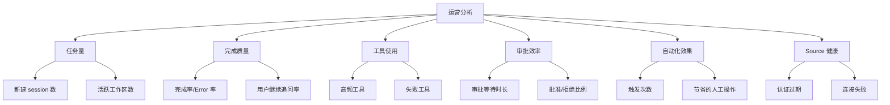

## 机会 12：Source/Skill 生态市场

长期看，Craft Agents 的扩展价值来自生态。

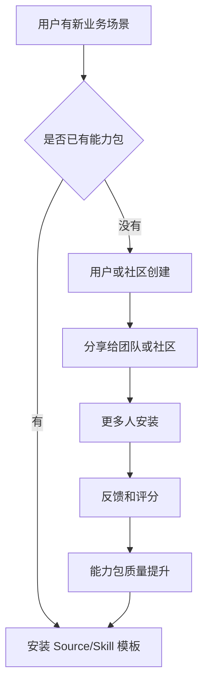

生态对象可以包括：

- Source 模板。
- Skill 模板。
- 自动化模板。
- 消息平台场景包。
- 行业 SOP 包。

## 优先级评估框架

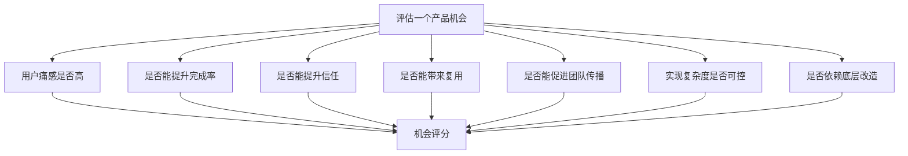

建议用下面的方式粗排：

| 机会 | 用户价值 | 传播价值 | 实现复杂度 | 建议 |
| --- | --- | --- | --- | --- |
| 会话任务化 | 高 | 中 | 中 | 优先 |
| Source 接入产品化 | 高 | 高 | 高 | 优先但分阶段 |
| 自动化可视化 | 高 | 高 | 高 | 做 MVP |
| 消息审批中心 | 高 | 高 | 中 | 优先 |
| 权限策略 | 高 | 中 | 中 | 随团队化推进 |
| Viewer 知识库化 | 中 | 高 | 中 | 适合增长 |
| 运行数据分析 | 中 | 中 | 中 | 团队版需要 |
| 生态市场 | 高 | 高 | 高 | 长期方向 |

## 推荐路线图

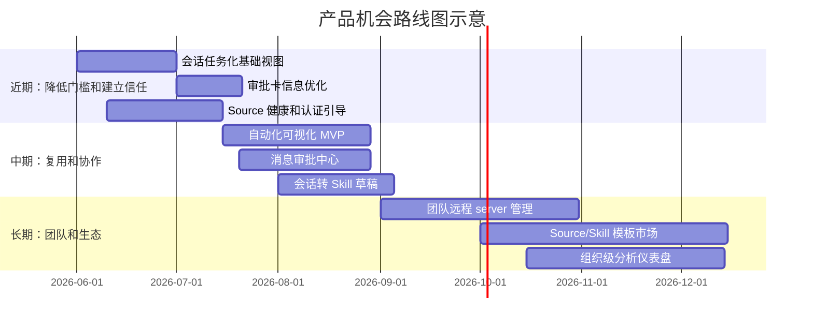

这只是产品节奏示例，不代表代码里已经有这些日期计划。

## 从 MVP 开始的三个切入点

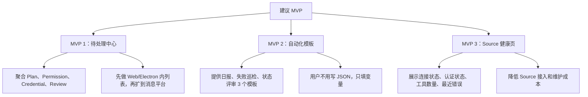

为什么这三个优先：

- 都直接降低非技术用户使用门槛。
- 都围绕已有架构对象，不需要完全重造底层。
- 都能产生明确指标。
- 都能支持后续团队化和自动化。

## 关键指标树

```mermaid
flowchart TD
  NSM["北极星：成功完成并被复用的 Agent 工作数"] --> A["完成"]
  NSM --> B["信任"]
  NSM --> C["复用"]
  NSM --> D["协作"]

  A --> A1["session complete rate"]
  A --> A2["tool success rate"]
  A --> A3["failure recovery rate"]

  B --> B1["plan approve rate"]
  B --> B2["permission approve rate"]
  B --> B3["credential success rate"]

  C --> C1["session to skill rate"]
  C --> C2["automation created rate"]
  C --> C3["template reused rate"]

  D --> D1["viewer share rate"]
  D --> D2["messaging binding count"]
  D --> D3["external approval count"]
```

## 需要避免的产品陷阱

```mermaid
flowchart TD
  ROOT["常见陷阱"] --> A["只优化聊天体验，忽略任务闭环"]
  ROOT --> B["让非技术用户手写太多配置"]
  ROOT --> C["权限弹窗只给按钮不给影响说明"]
  ROOT --> D["自动化触发了但用户不知道为什么"]
  ROOT --> E["Source 连接失败没有可操作修复路径"]
  ROOT --> F["远程和本地路径概念混淆"]
  ROOT --> G["分享结果只展示答案，不展示过程"]
```

对应的设计原则：

```mermaid
flowchart LR
  A["看得懂"] --> B["敢批准"]
  B --> C["能复用"]
  C --> D["可协作"]
  D --> E["可治理"]
```

## 最适合讲给业务团队的产品故事

```mermaid
flowchart TD
  A["一个 PM 创建需求分析会话"] --> B["Agent 连接 Linear、GitHub、Slack"]
  B --> C["生成计划并请求审批"]
  C --> D["PM 在 Telegram 批准"]
  D --> E["Agent 汇总需求、风险、相关代码"]
  E --> F["会话状态变为 Needs Review"]
  F --> G["自动化生成评审摘要"]
  G --> H["Viewer 分享给团队"]
  H --> I["团队把流程保存成 Skill 和自动化模板"]
```

这个故事串起了本仓库最核心的业务资产：

- 会话是任务容器。
- Source 让 Agent 进入业务系统。
- Plan 和 Permission 建立信任。
- 消息平台让审批不受端限制。
- 自动化让流程复用。
- Viewer 和 Skill 让成果传播和沉淀。

## 本文结论

Craft Agents 的产品机会应该围绕一个主线推进：把用户的一次成功使用，转成团队可复用的工作方式。

```mermaid
flowchart LR
  A["一次成功会话"] --> B["形成可理解过程"]
  B --> C["建立用户信任"]
  C --> D["沉淀 Skill/模板"]
  D --> E["自动化复用"]
  E --> F["消息平台协作"]
  F --> G["团队级扩散"]
  G --> A
```

