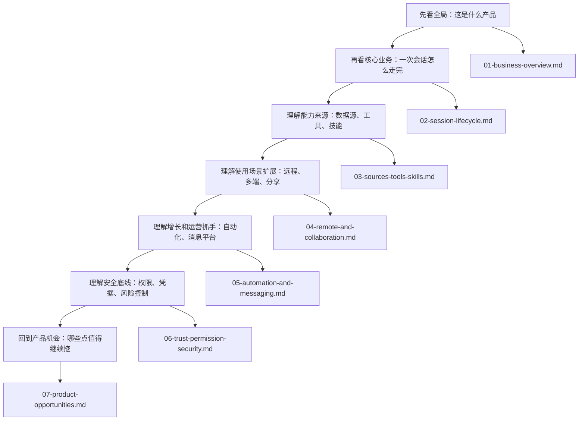
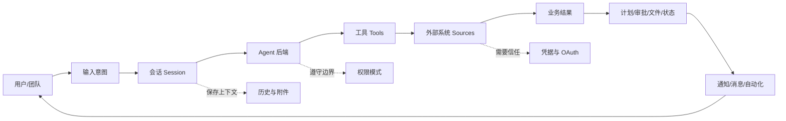
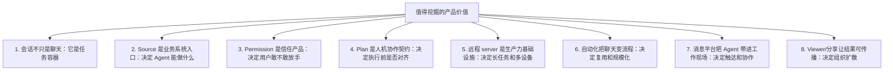

# 产品经理读业务逻辑：Mermaid 说明文档导航

这套文档面向不写代码的产品经理。它不从“代码怎么实现”开始讲，而是从“用户要完成什么业务动作”“系统中有哪些关键对象”“每个对象如何流转”“哪里值得继续挖掘产品价值”开始讲。

推荐阅读顺序：

## 文档清单

| 文档 | 解决的问题 | 你会看到什么 |
| --- | --- | --- |
| `01-business-overview.md` | Craft Agents 到底服务什么业务？ | 角色、价值链、产品能力地图、业务飞轮 |
| `02-session-lifecycle.md` | 用户从提问到结果落地，中间发生了什么？ | 会话状态机、消息流、权限流、计划流、分支流 |
| `03-sources-tools-skills.md` | 外部系统、工具、技能如何让 Agent 变强？ | Source 接入、认证、工具调用、guide、能力市场 |
| `04-remote-and-collaboration.md` | 为什么要支持远程、多端、CLI、Viewer？ | 本地/远程工作区、多端入口、分享、迁移 |
| `05-automation-and-messaging.md` | 如何把 Agent 从聊天框扩展成业务流程？ | 自动化触发、消息平台、审批按钮、运营闭环 |
| `06-trust-permission-security.md` | 产品如何让用户敢把任务交给 Agent？ | 权限模式、凭据、远程安全、失败恢复、治理策略 |
| `07-product-opportunities.md` | 后续最值得挖掘的产品方向有哪些？ | 机会地图、优先级、关键指标、路线建议 |

## 一句话总览

Craft Agents 的核心不是“一个聊天机器人”，而是一个把多种 Agent、外部工具、企业数据源、权限审批、远程执行、自动化和消息入口串在一起的“Agent 工作操作系统”。

## 最值得挖掘的业务点

## 读图方式

本文档大量使用 Mermaid。你不需要懂语法，只要按下面方式看：

- 方框通常表示“一个业务对象、系统模块或用户动作”。
- 箭头表示“下一步发生什么”。
- 菱形表示“判断或分支”。
- 时序图从上往下看，表示不同角色之间如何来回协作。
- 状态图表示一个对象从开始到结束会经历哪些状态。

